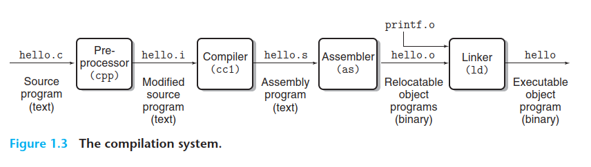
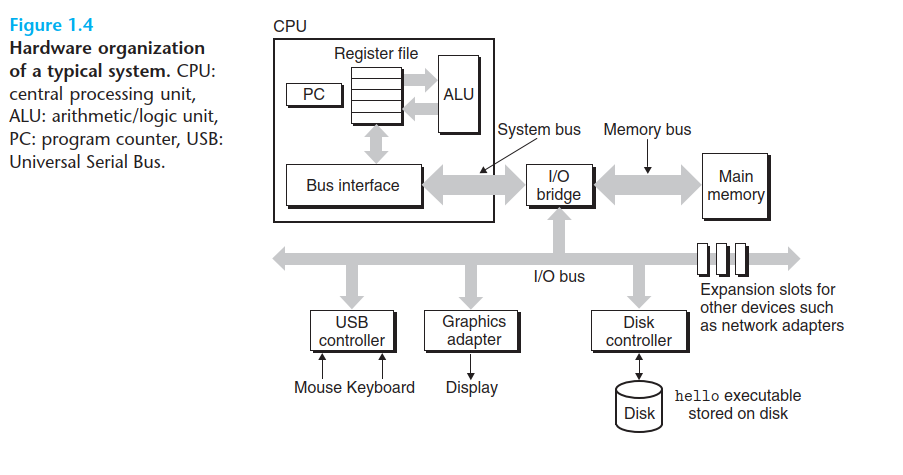
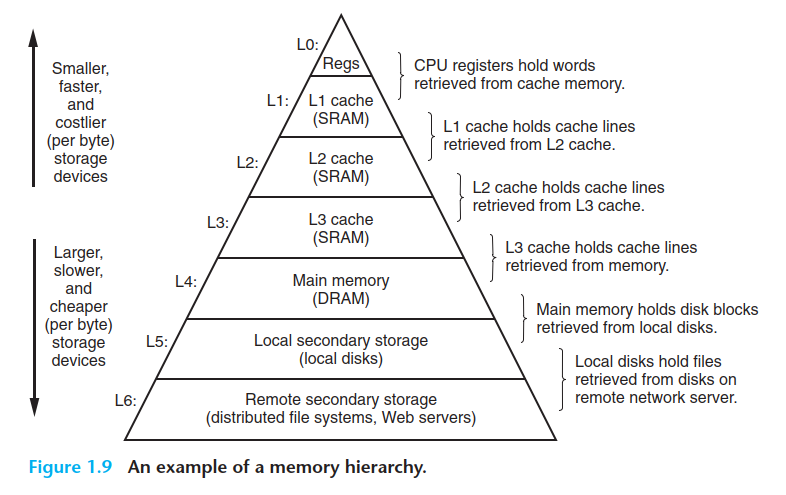
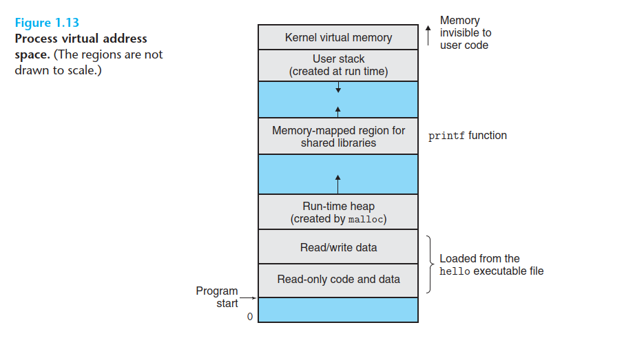

# 01: A Tour of Computer Systems

<!-- TOC start (generated with https://github.com/derlin/bitdowntoc) -->

- [01: A Tour of Computer Systems](#01-a-tour-of-computer-systems)
   * [1.1 Information Is Bits + Context](#11-information-is-bits-context)
   * [1.2 Programs Are Translated by Other Programs into Different Forms](#12-programs-are-translated-by-other-programs-into-different-forms)
   * [1.3 It Pays to Understand How Compilation Systems Work](#13-it-pays-to-understand-how-compilation-systems-work)
   * [1.4 Processors Read and Interpret Instructions Stored in Memory](#14-processors-read-and-interpret-instructions-stored-in-memory)
   * [1.4.1 Hardware Organization of a System](#141-hardware-organization-of-a-system)
      + [Buses](#buses)
      + [I/O Devices](#io-devices)
      + [Main Memory](#main-memory)
      + [Processor](#processor)
   * [1.5 Caches Matter](#15-caches-matter)
   * [1.6 Storage Devices Form a Hierarchy](#16-storage-devices-form-a-hierarchy)
   * [1.7 The Operating System Manages the Hardware](#17-the-operating-system-manages-the-hardware)
      + [1.7.1 Processes](#171-processes)
      + [1.7.2 Threads](#172-threads)
      + [1.7.3 Virtual Memory](#173-virtual-memory)
      + [1.7.4 Files](#174-files)
   * [1.8 Systems Communicate with Other Systems Using Networks](#18-systems-communicate-with-other-systems-using-networks)
   * [1.9 Important Themes](#19-important-themes)
      + [1.9.1 Amdahl's Law](#191-amdahls-law)
      + [1.9.2 Concurrency and Parallelism](#192-concurrency-and-parallelism)
         - [Thread Level Concurrency](#thread-level-concurrency)
         - [Instruction Level Parallelism](#instruction-level-parallelism)
         - [Single instruction, Multiple-Data(SIMD) Parallelism](#single-instruction-multiple-datasimd-parallelism)
      + [1.9.3 The Importance of Abstractions in Computer Systems](#193-the-importance-of-abstractions-in-computer-systems)
   * [1.10 Summary](#110-summary)

<!-- TOC end -->

<!-- TOC --><a name="01-a-tour-of-computer-systems"></a>

A computer system consists of hardware and systems software that work together to run application programs. Specific implementations of system change over time, but the underlying concepts do not. All computer systems have similar hardware and software components that perform similar functions.

We will use a simple C _hello world_ program (the model program, or _the program_ from now on) for didactic purposes:

```c
#include <stdio.h>

int main()
{
  printf("hello, world\n");
  return 0;
}
```

## 1.1 Information Is Bits + Context

The program begins life as a _source program_ or _source file_. The source program is a sequence of bits (each with a value of 0 or 1) organized in 8-bit chunks called _bytes_. Each byte represents some text character in the program.

The `hello.c` program is stored in a file as a sequence of bytes. Each byte has an integer value that corresponds to some character. Files such as `hello.c` that consist exclusively of ASCII characters are known as _text files_. All other files are known as `binary files`.

All information in a system-including disk files, programs stored in memory, user data stored in memory and data transferred across a network- is represented as a bunch of bits. The only think that distinguishes different data objects is the context in which we view them.

We need to understand machine representations of numbers; they are not the same as real integers and real numbers. They are finite approximations that can behave in unexpected ways.

## 1.2 Programs Are Translated by Other Programs into Different Forms

The program begins life as a high-level C program because it can be read and understood by human beings; the individual C statements must be translated by other programs into a sequence of low-level machine_language instructions. These instructions are then packaged in a form called an executable object program and stored as a binary disk file. Object programs are also referred as executable object files.

On a Unix system, the translation from source file to object file is performed by a compiler driver:



The translation is performed in the sequence of four phases:

- Preprocessing: the cpp preprocessor modifies the original C program according to directives that begin with `#`. In our case, this means the reading of system header files and its insertion direction into the program text.
- Compilation: The compiler cc1 translates the textile into assembly language. Assembly language is useful because it provides a common output language for different compilers for different high level languages.
- Assembly: the assembler (as) translates the file into machine-language instructions, packages them in a form known as a relocatable object program, and stores in another file.
- Linking: In this phase, functions that reside in separate pre-compiled object files, like `printf`, part of the standard C library, needs to be merged with the file. The resulting file is an executable object file ready to be loaded into memory and executed by the system.

## 1.3 It Pays to Understand How Compilation Systems Work

There are three main reasons why programmers need to understand how compilation systems work:

- Optimizing program performance: in order to make good coding decisions in our C programs, we do need a basic understanding of machine-level code and how the compiler translates different C statements into machine code.

> For example, is a `switch` statement always more efficient than a sequence of if-else statements? How much overhead is incurred by a function call? Is a while loop more efficient than a for loop? Are pointer references more efficient than array indexes? Why does our loop run so much faster if we sum into a local variable instead of an argument that is passed by reference? How can a function run faster when we simply rearrange the parentheses in an arithmetic expression?

- Understanding link-time errors: some of the most perplexing programming errors are related to the operation of the linker, especially when you are trying to build large software systems. 

> what does it mean when the linker reports that it cannot resolve a reference? What is the difference between a static variable and a global variable? What happens if you define two global variables in different C files with the same name?

- Avoiding security holes:

> buffer overflow vulnerabilities have accounted for many of the security holes in network and Internet servers. These vulnerabilities exist because too few programmers understand the need
to carefully restrict the quantity and forms of data they accept from untrusted sources. A first step in learning secure programming is to understand the consequences of the way data and control information are stored on the program stack. 

## 1.4 Processors Read and Interpret Instructions Stored in Memory

To run the executable file on a Unix system, we type its name to an application program known as a _shell_:

```text
linux> ./hello
hello, world
linux>
```

The shell is a command-line interpreter that prints a prompt, waits for you to type a command line, and then performs the command. If the first word of the command line does not correspond to a built-in shell command, then the shell assumes that it is the name of an executable file that it should load and run.

## 1.4.1 Hardware Organization of a System



### Buses

Running throughout the system is a collection of electrical conduits called **buses** that carry bytes of information back and forth between the components. Buses are typically designed to transfer fixed-size chunks of bytes known as **words**. The number of bytes in a word (the word size) is a fundamental system parameter that varies across systems. Most machines today have word sizes of either 4 bytes (32 bits) or 8 bytes (64 bits).

### I/O Devices

Input/output (I/O) devices are the system’s connection to the external world.

Each I/O device is connected to the I/O bus by either a **controller** or an **adapter**. The distinction between the two is mainly one of packaging:

- Controllers are chip sets in the device itself or on the system’s main printed circuit board (often called the motherboard). 
- An adapter is a card that plugs into a slot on the motherboard. Regardless, the purpose of each is to transfer information back and forth between the I/O bus and an I/O device.

### Main Memory

The main memory is a temporary storage device that holds both a _program_ and the _data_ it manipulates while the processor is executing the program.

- Physically, main memory consists of a collection of dynamic random access memory (**DRAM**) chips. 
- Logically, memory is organized as a linear array of bytes, each with its own unique address (array index) starting at zero. 

In general, each of the machine instructions that constitute a program (a set of instructions) can consist of a variable number of bytes. The sizes of data items that correspond to C program variables vary according to type.

### Processor

The central processing unit (**CPU**), or simply **processor**, is the engine that interprets (or executes) instructions stored in main memory. At its core is a word-size storage device (or **register**) called the **program counter** (PC). At any point in time, the PC **points at** (contains the address of) some machine-language instruction in main memory.

From the time that power is applied to the system until the time that the power is shut off, a processor repeatedly executes the instruction pointed at by the program counter and updates the program counter to point to the next instruction. A processor appears to operate according to a very simple instruction execution model, defined by its **instruction set architecture**. In this model, instructions execute in strict sequence, and executing a single instruction involves performing a series of steps. The processor reads the instruction from memory pointed at by the program counter (PC), interprets the bits in the instruction, performs some simple operation dictated by the instruction, and then updates the PC to point to the next instruction, which may or may not be contiguous in memory to the instruction that was just executed.

There are only a few of these simple operations, and they revolve around main memory, the register file, and the arithmetic/logic unit (**ALU**). The register file is a small storage device that consists of a collection of word-size registers, each with its own unique name. The ALU computes new data and address values.

Here are some examples of the simple operations that the CPU might carry out at the request of an instruction:

- **Load**: Copy a byte or a word _from main memory into a register_, overwriting the previous contents of the register.
- **Store**: Copy a byte or a word _from a register to a location in main memory_, overwriting the previous contents of that location. 
- **Operate**: Copy the _contents of two registers to the ALU, perform an arithmetic operation on the two words, and store the result in a register_, overwriting the previous contents of that register. 
- **Jump**: _Extract a word from the instruction itself and copy that word into the program counter (PC)_, overwriting the previous value of the PC.

Modern processors use far more complex mechanisms to speed up program execution. Thus, we can distinguish the pro- cessor’s instruction set architecture, describing the effect of each machine-code instruction, from its microarchitecture, describing how the processor is actually implemented.

## 1.5 Caches Matter

A system spends a lot of time moving information from one place to another. The machine instructions in the program are originally stored on disk. When the program is loaded, they are copied to main memory. As the processor runs the program, instructions are copied from main memory into the processor. Similarly, the data string `hello, world\n`, originally on disk, is copied to main memory and then copied from main memory to the display device. From a programmer’s perspective, much of this copying is overhead that slows down the “real work” of the program. Thus, a major goal for system designers is to make these copy operations run as fast as possible.

Because of physical laws, larger storage devices are slower than smaller storage devices. And faster devices are more expensive to build than their slower counterparts.

A typical register file stores only a few hundred bytes of information, as opposed to billions of bytes in the main memory. However, the processor can read data from the register file almost 100 times faster than from memory. Even more troublesome, as semiconductor technology progresses over the years, this processor–memory gap continues to increase. It is easier and cheaper to make processors run faster than it is to make main memory run faster.

To deal with the processor–memory gap, system designers include smaller, faster storage devices called **cache memories** (or simply caches) that serve as temporary staging areas for information that the processor is likely to need in the near future.

An L1 cache on the processor chip holds tens of thousands of bytes and can be accessed nearly as fast as the register file. A larger L2 cache with hundreds of thousands to millions of bytes is connected to the processor by a special bus. It might take 5 times longer for the processor to access the L2 cache than the L1 cache, but this is still 5 to 10 times faster than accessing the main memory. The L1 and L2 caches are implemented with a hardware technology known as **static random access memory** (SRAM). Newer and more powerful systems even have three levels of cache: L1, L2, and L3. 

The idea behind caching is that _a system can get the effect of both a very large memory and a very fast one by exploiting **locality**_, the tendency for programs to access data and code in localized regions. By setting up caches to hold data that are likely to be accessed often, we can perform most memory operations using the fast caches.

One of the most important lessons in this book is that application _programmers who are aware of cache memories can exploit them to improve the performance of their programs by an order of magnitude_.



## 1.6 Storage Devices Form a Hierarchy

The storage devices in every computer system are organized as a **memory hierarchy**. The main idea of a memory hierarchy is that storage at one level serves as a cache for storage at the next lower level. Thus, the register file is a cache for the L1 cache. Caches L1 and L2 are caches for L2 and L3, respectively. The L3 cache is a cache for the main memory, which is a cache for the disk. On some networked systems with distributed file systems, the local disk serves as a cache for data stored on the disks of other systems.

## 1.7 The Operating System Manages the Hardware


The programs do not access keyboard, display, disk, or main memory directly. Rather, they relied on the services provided by the operating system. We can think of the operating system as a layer of software interposed between the application program and the hardware. All attempts by an application program to manipulate the hardware must go through the operating system.

The operating system has two primary purposes: 

1. To protect the hardware from misuse by runaway applications and 
2. to provide applications with simple and uniform mechanisms for manipulating complicated and often wildly different low-level hardware devices. 

The operating system achieves both goals via the fundamental abstractions shown in Figure 1.11: processes, virtual memory, and files. As this figure suggests, 

- files are abstractions for I/O devices, 
- virtual memory is an abstraction for both the main memory and disk I/O devices, 
- processes are abstractions for the processor, main memory, and I/O devices.

### 1.7.1 Processes

A process is the operating system’s abstraction for a running program. Multiple processes can run concurrently on the same system, and each process appears to have exclusive use of the hardware. By concurrently, we mean that the instruc- tions of one process are interleaved with the instructions of another process. In most systems, there are more processes to run than there are CPUs to run them.

Traditional systems could only execute one program at a time, while newer multicore processors can execute several programs simultaneously. In either case, a single CPU can appear to execute multiple processes concurrently by having the processor switch among them. The operating system performs this interleaving with a mechanism known as **context switching**. 

The operating system keeps track of all the state information that the process needs in order to run. This state, which is known as the **context**, includes information such as the current values of the PC, the register file, and the contents of main memory.

At any point in time, a uniprocessor system can only execute the code for a single process. When the operating system decides to transfer control from the current process to a new process, it performs a context switch by saving the context of the current process, restoring the context of the new process, and then passing control to the new process. The new process picks up exactly where it left off.

When we ask it to run the `hello` program, the shell carries out our request by invoking a special function known as a **system call** that passes control to the operating system. The operating system saves the shell’s context, creates a new `hello` process and its context, and then passes control to the new `hello` process. After `hello` terminates, the operating system restores the context of the shell process and passes control back to it, where it waits for the next command-line input.

The transition from one process to another is managed by the operating system **kernel**. The kernel is the portion of the operating system code that is always resident in memory. When an application program requires some action by the operating system, such as to read or write a file, it executes a special system call instruction, transferring control to the kernel. The kernel then performs the requested operation and returns to the application program. Note that the kernel is not a separate process. Instead, it is a collection of code and data structures that the system uses to manage all the processes.

Implementing the process abstraction requires close cooperation between both the low-level hardware and the operating system software.

### 1.7.2 Threads

Although we normally think of a process as having a single control flow, in modern systems a process can actually consist of multiple execution units, called **threads**, each running in the context of the process and sharing the same code and global data. Threads are an increasingly important programming model because of the requirement for concurrency in network servers, because it is easier to share data between multiple threads than between multiple processes, and because threads are typically more efficient than processes. Multi-threading is also one way to make programs run faster when multiple processors are available.

### 1.7.3 Virtual Memory



Virtual memory is an abstraction that provides each process with the illusion that it has exclusive use of the main memory. Each process has the same uniform view of memory, which is known as its **virtual address space**. The virtual address space for Linux processes is shown in Figure 1.13. (Other Unix systems use a similar layout.)

In Linux, the topmost region of the address space is reserved for code and data in the operating system that is common to all processes. The lower region of the address space holds the code and data defined by the user’s process. Note that addresses in the figure increase from the bottom to the top.

The virtual address space seen by each process consists of a number of well-defined areas, each with a specific purpose: (From bottom to top):

- **Program code and data**: Code begins at the same fixed address for all processes, followed by data locations that correspond to global C variables. The code and data areas are initialized directly from the contents of an executable object file
- **Heap**: The code and data areas are followed immediately by the run-time heap. Unlike the code and data areas, which are fixed in size once the process begins running, the heap expands and contracts dynamically at run time as a result of calls to C standard library routines such as `malloc` and `free`.
- **Shared libraries**: Near the middle of the address space is an area that holds the code and data for shared libraries such as the C standard library and the math library. The notion of a shared library is a powerful but somewhat difficult concept.
- **Stack**: At the top of the user’s virtual address space is the user stack that the compiler uses to implement function calls. Like the heap, the user stack expands and contracts dynamically during the execution of the program. In particular, each time we call a function, the stack grows. Each time we return from a function, it contracts.
- **Kernel virtual memory**. The top region of the address space is reserved for the kernel. Application programs are not allowed to read or write the contents of this area or to directly call functions defined in the kernel code. Instead, they must invoke the kernel to perform these operations.

For virtual memory to work, a sophisticated interaction is required between the hardware and the operating system software, including a hardware translation of every address generated by the processor. The basic idea is to store the contents of a process’s virtual memory on disk and then use the main memory as a cache for the disk.

### 1.7.4 Files

A file is a sequence of bytes, nothing more and nothing less. Every I/O device, including disks, keyboards, displays, and even networks, is modeled as a file. All input and output in the system is performed by reading and writing files, using a small set of system calls known as Unix I/O.

This simple and elegant notion of a file is nonetheless very powerful because it provides applications with a uniform view of all the varied I/O devices that might be contained in the system.

## 1.8 Systems Communicate with Other Systems Using Networks

In practice, modern systems are often linked to other systems by networks. From the point of view of an individual system, the network can be viewed as just another I/O device. When the system copies a sequence of bytes from main memory to the network adapter, the data flow across the network to another machine, instead of, say, to a local disk drive. Similarly, the system can read data sent from other machines and copy these data to its main memory.

## 1.9 Important Themes

A system is more than just hardware. It is a collection of intertwined hardware and systems software that must cooperate in order to achieve the ultimate goal of running application programs.

### 1.9.1 Amdahl's Law

Gene Amdahl, one of the early pioneers in computing, made a simple but insightful observation about the effectiveness of improving the performance of one part of a system. This observation has come to be known as **Amdahl’s law**. The main idea is that when we speed up one part of a system, the effect on the overall system performance depends on both how significant this part was and how much it sped up. Consider a system in which executing some application requires time Told. Suppose some part of the system requires a fraction `a` of this time, and that we improve its performance by a factor of `k`. That is, the component originally required time `aTold`, and it now requires time `(aTold)/k`. The overall execution time would thus be 

$$
T_{new}= (1 - \alpha)T_{old} + (\alpha T_{old})/k
       = T_{old}[(1 - \alpha) + \alpha/k]
$$

From this, we can compute the speedup

$$
S=\frac{1}{(1 - \alpha) + \alpha/k}
$$

This is the major insight of Amdahl’s law: to significantly speed up the entire system, we must improve the speed of a very large fraction of the overall system.

> The best way to express a performance improvement is as a ratio of the form `Told/Tnew`, where `Told` is the time required for the original version and `Tnew` is the time required by the modifed version. This will be a number greater than 1.0 if any real improvement occurred. We use the sufix ‘×’ to indicate such a ratio, where the factor “2.2×” is expressed verbally as “2.2 times.”

### 1.9.2 Concurrency and Parallelism

We use the term **concurrency** to refer to the general concept of a system with multiple, simultaneous activities, and the term **parallelism** to refer to the use of concurrency to make a system run faster. Parallelism can be exploited at multiple levels of abstraction in a computer system. We highlight three levels here, working from the highest to the lowest level in the system hierarchy.

#### Thread Level Concurrency

We are able to devise systems where multiple programs execute at the same time, leading to concurrency. With threads, we can even have multiple control flows executing within a single process.

Traditionally, this concurrent execution was only simulated, by having a single computer rapidly switch among its executing processes, much as a juggler keeps multiple balls flying through the air. This form of concurrency allows multiple users to interact with a system at the same time, such as when many people want to get pages from a single Web server. It also allows a single user to engage in multiple tasks concurrently, such as having a Web browser in one window, a word processor in another, and streaming music playing at the same time. Until recently, most actual computing was done by a single processor, even if that processor had to switch among multiple tasks. This configuration is known as a **uniprocessor** system.

When we construct a system consisting of multiple processors all under the control of a single operating system kernel, we have a *multiprocessor* system.

Multi-core processors have several CPUs (referred to as “cores”) integrated onto a single integrated-circuit chip. In a typical multi-core processor, the chip has four CPU cores, each with its own L1 and L2 caches, and with each L1 cache split into two parts—one to hold recently fetched instructions and one to hold data. The cores share higher levels of cache as well as the interface to main memory.

**Hyperthreading**, sometimes called simultaneous multi-threading, is a technique that allows a single CPU to execute multiple 
flows of control. It involves having multiple copies of some of the CPU hardware, such as program counters and register files, while having only single copies of other parts of the hardware, such as the units that perform floating-point arithmetic. A hyperthreaded processor decides which of its threads to execute on a cycle-by- cycle basis. It enables the CPU to take better advantage of its processing resources.

The use of multiprocessing can improve system performance in two ways:

- First, it reduces the need to simulate concurrency when performing multiple tasks. 
- Second, it can run a single application program faster, but only if that program is expressed in terms of multiple threads that can effectively execute in parallel.

Thus, although the principles of concurrency have been formulated and studied for over 50 years, the advent of multi-core and hyperthreaded systems has greatly increased the desire to find ways to write application programs that can exploit the thread-level parallelism available with the hardware.

#### Instruction Level Parallelism

At a much lower level of abstraction, modern processors can execute multiple instructions at one time, a property known as instruction-level parallelism. More recent processors can sustain execution rates of 2–4 instructions per clock cycle. Any given instruction requires much longer from start to finish, perhaps 20 cycles or more, but the processor uses a number of clever tricks to process as many as 100 instructions at a time.

Processors that can sustain execution rates faster than 1 instruction per cycle are known as superscalar processors. Most modern processors support superscalar operation. Application programmers can use this model to understand the performance of their programs. They can then write programs such that the generated code achieves higher degrees of instruction-level parallelism and therefore runs faster.

#### Single instruction, Multiple-Data(SIMD) Parallelism

At the lowest level, many modern processors have special hardware that allows a single instruction to cause multiple operations to be performed in parallel, a mode known as single-instruction, multiple-data (SIMD) parallelism.

These SIMD instructions are provided mostly to speed up applications that process image, sound, and video data. Although some compilers attempt to automatically extract SIMD parallelism from C programs, a more reliable method is to write programs using special vector data types supported in compilers such as gcc.


### 1.9.3 The Importance of Abstractions in Computer Systems

The use of abstractions is one of the most important concepts in computer science. For example, one aspect of good programming practice is to formulate a simple application program interface (API) for a set of functions that allow programmers to use the code without having to delve into its inner workings. Different programming languages provide different forms and levels of support for abstraction, such as Java class declarations and C function prototypes.

On the processor side, the instruction set architecture provides an abstraction of the actual processor hardware. With this abstraction, a machine-code program behaves as if it were executed on a processor that performs just one instruction at a time. The underlying hardware is far more elaborate, executing multiple instructions in parallel, but always in a way that is consistent with the simple, sequential model.

On the operating system side, we have introduced three abstractions: files as an abstraction of I/O devices, virtual memory as an abstraction of program memory, and processes as an abstraction of a running program. To these abstractions we add a new one: the virtual machine, providing an abstraction of the entire computer, including the operating system, the processor, and the programs.

## 1.10 Summary

On the operating system side, we have introduced three abstractions: files as an abstraction of I/O devices, virtual memory as an abstraction of program memory, and processes as an abstraction of a running program. To these abstractions we add a new one: the virtual machine, providing an abstraction of the entire computer, including the operating system, the processor, and the programs
hierarchy. Storage devices that are higher in the hierarchy serve as caches for devices that are lower in the hierarchy. 

Programmers can optimize the performance of their C programs by understanding and exploiting the memory hierarchy. The operating system kernel serves as an intermediary between the application and the hardware. It provides three fundamental abstractions: (1) Files are abstractions for I/O devices. (2) Virtual memory is an abstraction for both main memory and disks. (3) Processes are abstractions for the processor, main memory, and I/O devices. 

Finally, networks provide ways for computer systems to communicate with one another. From the viewpoint of a particular system, the network is just another I/O device.
