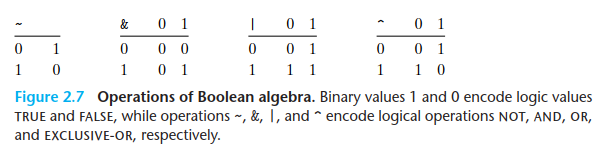
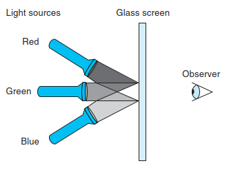
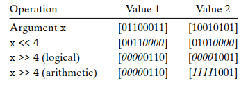

# 02: Representing and Manipulating Information

Modern computers store and process information represented as two-valued signals. These lowly binary digits, or bits, form the basis of the digital revolution.

Binary values work better when building machines that store and process information. Two-valued signals can readily be represented, stored, and transmitted. The electronic circuitry for storing and performing computations on two-valued signals is very simple and reliable, enabling manufacturers to integrate millions, or even billions, of such circuits on a single silicon chip.

When we group bits together and apply some interpretation that gives meaning to the different possible bit patterns, however, we can represent the elements of any finite set (numbers, letters and symbols, operations...)

We consider the three most important representations of numbers:

- Unsigned encodings are based on traditional binary notation, representing numbers greater than or equal to 0. 
- Two’s-complement encodings are the most common way to represent signed integers, that is, numbers that may be either positive or negative. 
- Floating-point encodings are a base-2 version of scientific notation for representing real numbers. Computers implement arithmetic operations, such as addition and multiplication, with these different representations, similar to the corresponding operations on integers and real numbers.

Computer representations use a limited number of bits to encode a number, and hence some operations can **overflow** when the results are too large to be represented. For example, in a 32 bit machine,

```t
200 * 300 * 400 * 500
```

yields 

```t
-884,901,888
```

**Integer** computer arithmetic satisfies many of the familiar properties of true integer arithmetic, like associative and conmutative properties; all these expressions yield the same result `-884,901,888`:

```t
(500 * 400) * (300 * 200)
((500 * 400) * 300) * 200
((200 * 500) * 300) * 400
400 * (200 * (300 * 500))
```

**Floating-point** arithmetic has altogether different mathematical properties. The product of a set of positive numbers will always be positive, although overflow will yield the special value +8. Floating-point arithmetic is not associative due to the finite precision of the representation.

The different mathematical properties of integer versus floating-point arithmetic stem from the difference in how they handle the finiteness of their representations—integer representations can encode a comparatively small range of values, but do so precisely, while floating-point representations can encode a wide range of values, but only approximately.

By studying the actual number representations, we can understand the ranges of values that can be represented and the properties of the different arithmetic operations. This understanding is critical to writing programs that work correctly over the full range of numeric values and that are portable across different combinations of machine, operating system, and compiler.

A number of computer security vulnerabilities have arisen due to some of the subtleties of computer arithmetic.

We will derive several ways to perform arithmetic operations by directly manipulating the bit-level representations of numbers Understanding these techniques will be important for understanding the machine-level code generated by compilers in their attempt to optimize the performance of arithmetic expression evaluation.

The C++ programming language is built upon C, using the exact same numeric representations and operations. Everything said in this chapter about C also holds for C++.

## 2.1 Information Storage

Rather than accessing individual bits in memory, most computers use blocks of 8 bits, or **bytes**, as the smallest addressable unit of memory. A machine-level program views memory as a very large array of bytes, referred to as **virtual memory**. Every byte of memory is identified by a unique number, known as its **address**, and the set of all possible addresses is known as the **virtual address space**.

This virtual address space is just a conceptual image presented to the machine-level program. The actual implementation uses a combination of dynamic random access memory (DRAM), flash memory, disk storage, special hardware, and operating system software to provide the program with what appears to be a monolithic byte array.

The compiler and run-time system partitions this memory space into more manageable units to store the different program objects, that is, program data, instructions, and control information. Various mechanisms are used to allocate and manage the storage for different parts of the program. This management is all performed within the virtual address space.

>For example, the value of a pointer in C—whether it points to an integer, a structure, or some other program object—is the virtual address of the first byte of some block of storage.
>
>The C compiler also associates type information with each pointer, so that it can generate different machine-level code to access the value stored at the location designated by the pointer depending on the type of that value. Although the C compiler maintains this type information, the actual machine-level program it generates has no information about data types. It simply treats each program object as a block of bytes and the program itself as a sequence of bytes.

>Pointers are a central feature of C. They provide the mechanism for referencing elements of data structures, including arrays. Just like a variable, a pointer has two aspects: its value and its type. The value indicates the location of some object, while its type indicates what kind of object (e.g., integer or floating-point number) is stored at that location.
> 
>Truly understanding pointers requires examining their representation and implementation at the machine level.

### 2.1.1 Hexadecimal Notation

A single byte consists of 8 bits. In binary notation, its value ranges from 00000000 to 11111111. When viewed as a decimal integer, its value ranges from 0 to 255.

Neither notation is very convenient for describing bit patterns; we write bit patterns as base-16, or hexadecimal numbers.


### 2.1.2 Data Sizes

Every computer has a **word** size, indicating the nominal size of pointer data. Since a virtual address is encoded by such a word, the most important system parameter determined by the word size is the maximum size of the virtual address space. The word size determines the maximum memory address number it can represent; that is, for a machine with a w-bit word size, the virtual addresses can range from 0 to 2<sup>w</sup> - 1, giving the program access to at most 2<sup>w</sup> bytes.

In recent years, there has been a widespread shift from machines with 32- bit word sizes to those with word sizes of 64 bits. A 32-bit word size limits the virtual address space to 4 gigabytes (written 4 GB), that is, just over 4 × 10<sup>9</sup> bytes. Scaling up to a 64-bit word size leads to a virtual address space of 16 exabytes, or around 1.84 × 10<sup>19</sup> bytes.

Most 64-bit machines can also run programs compiled for use on 32-bit machines, a form of backward compatibility.

Computers and compilers support multiple data formats using different ways to encode data, such as integers and floating point, as well as different lengths.

The C language supports multiple data formats for both integer and floating- point data. Figure 2.3 shows the number of bytes typically allocated for different C data types.


Programmers should strive to make their programs portable across different machines and compilers. One aspect of portability is to make the program insensitive to the exact sizes of the different data types. The C standards set lower bounds on the numeric ranges of the different data types, as will be covered later, but there are no upper bounds (except with the fixed-size types).

### 2.1.3 Addressing and Byte Ordering

For program objects that span multiple bytes, we must establish two conventions: what the address of the object will be, and how we will order the bytes in memory. In virtually all machines, a multi-byte object is stored as a contiguous sequence of bytes, with the address of the object given by the smallest (the "first") address of the bytes used.

For ordering the bytes representing an object, there are two common conventions:

- Some machines choose to store the object in memory ordered from the least significant byte to most, while other machines store them from most to least. The former convention—where the least significant byte comes first—is referred to as **little endian**. 
- The latter convention—where the most significant byte comes first—is referred to as **big endian**.

Most Intel-compatible machines operate exclusively in little-endian mode. On the other hand, most machines from IBM and Oracle (arising from their acquisition of Sun Microsystems in 2010) operate in big-endian mode. Many recent microprocessor chips are **bi-endian**, meaning that they can be configured to operate as either little- or big-endian machines. In practice, however, byte ordering becomes fixed once a particular operating system is chosen.

There is no technological reason to choose one byte ordering convention over the other, and hence the arguments degenerate into bickering about sociopolitical issues. As long as one of the conventions is selected and adhered to consistently, the choice is arbitrary. For most application programmers, the byte orderings used by their machines are totally invisible; programs compiled for either class of machine give identical results. At times, however, byte ordering becomes an issue:

- When binary data are communicated over a network between different machines. A common problem is for data produced by a little-endian machine to be sent to a big-endian machine, or vice versa, leading to the bytes within the words being in reverse order for the receiving program. To avoid such problems, code written for networking applications must follow established conventions
- A second case where byte ordering becomes important is when looking at the byte sequences representing integer data. This occurs often when inspecting machine-level programs.
- When programs are written that circumvent the normal type system. In the C language, this can be done using a cast or a union to allow an object to be referenced according to a different data type from which it was created.

### 2.1.4 Representing Strings

A string in C is encoded by an array of characters terminated by the **null** (having value 0) character. Each character is represented by some standard encoding, with the most common being the ASCII character code.

>The Unicode Consortium has devised the most comprehensive and widely accepted standard for encoding text. The current Unicode standard (version 7.0) has a repertoire of over 100,000 characters supporting a wide range of languages, including the ancient languages of Egypt and Babylon.
>
>The base encoding, known as the “Universal Character Set” of Unicode, uses a 32-bit representation of characters. This would seem to require every string of text to consist of 4 bytes per character. However, alternative codings are possible where common characters require just 1 or 2 bytes, while less common ones require more. In particular, the UTF-8 representation encodes each character as a sequence of bytes, such that the standard ASCII characters use the same single-byte encodings as they have in ASCII, implying that all ASCII byte sequences have the same meaning in UTF-8 as they do in ASCII.

Text data are more platform independent than binary data.

### 2.1.5 Representing Code

Instruction codings are different. Different machine types use different and incompatible instructions and encodings. Even identical processors running different operating systems have differences in their coding conventions and hence are not binary compatible. Binary code is seldom portable across different combinations of machine and operating system.

As an example, consider a C function and the generated machine code when compiled on different machines:

```c
int sum(int x, int y) {
  return x + y;
}
```

**Linux 32** `55 89 e5 8b 45 0c 03 45 08 c9 c3 `
**Windows** `55 89 e5 8b 45 0c 03 45 08 5d c3 `
**Sun** `81 c3 e0 08 90 02 00 09` 
**Linux** `64 55 48 89 e5 89 7d fc 89 75 f8 03 45 fc c9 c3`

### 2.1.6 Introduction to Boolean Algebra

This started with the work of George Boole (1815– 1864) around 1850 and thus is known as Boolean algebra. Boole observed that by encoding logic values true and false as binary values 1 and 0, he could formulate an algebra that captures the basic principles of logical reasoning.

The simplest Boolean algebra is defined over the two-element set {0, 1}.



Claude Shannon (1916–2001), who later founded the field of information theory, first made the connection between Boolean algebra and digital logic. In his 1937 master’s thesis, he showed that Boolean algebra could be applied to the design and analysis of networks of electromechanical relays. Although computer technology has advanced considerably since, Boolean algebra still plays a central role in the design and analysis of digital systems.

We can extend the four Boolean operations to also operate on bit vectors, strings of zeros and ones of some fixed length w. We define the operations over bit vectors according to their applications to the matching elements of the arguments.

Let a and b denote the bit vectors [a<sub>w-1</sub>, a<sub>w-2</sub>, . . . , a<sub>0</sub>] and [b<sub>w-1</sub>, b<sub>w-2</sub>, . . . , b<sub>0</sub>], respectively. We define _a & b_ to also be a bit vector of length _w_, where the _ith_ element equals a<sub>i</sub> & b<sub>i</sub>, for 0 = i < w.

As examples, consider the case where w = 4, and with arguments a = [0110] and b = [1100]. Then the four operations _a & b_, _a | b_, _a ^ b_, and _~b_ yield:


One useful application of bit vectors is to represent finite sets. We can encode any subset A ? {0, 1, . . . , w - 1} with a bit vector [aw-1, . . . , a1, a0], where ai = 1if and only if i ? A. For example, recalling that we write aw-1 on the left and a0 on the right, bit vector a = [01101001] encodes the set A = {0, 3, 5, 6}, while bit vector b = [01010101]encodes the set B = {0, 2, 4, 6}. With this way of encoding sets, Boolean operations | and & correspond to set union and intersection, respectively, and ~ corresponds to set complement. Continuing our earlier example, the operation a & b yields bit vector [01000001], while A n B = {0, 6}.

#### Interesting! 

Computers generate color pictures on a video screen or liquid crystal display by mixing three different colors of light: red, green, and blue. Imagine a simple scheme, with three different lights, each of which can be turned on or off, projecting onto a glass screen:



We can then create eight different colors based on the absence (0) or presence (1) of light sources R, G, and B:

| R G B | Color  |
| --- | --- |
| 0 0 0 | Black  |
| 0 0 1 | Blue  |
| 0 1 0 | Green  |
| 0 1 1 | Cyan  |
| 1 0 0 | Red  |
| 1 0 1 | Magenta  |
| 1 1 0 | Yellow  |
| 1 1 1 | White |

Each of these colors can be represented as a bit vector of length 3, and we can apply Boolean operations to them.

### 2.1.7 Bit-Level Operations in C

One useful feature of C is that it supports bitwise Boolean operations. In fact, the symbols we have used for the Boolean operations are exactly those used by C: `|` for _or_, `&` for _and_, `~` for _not_, and `^` for _exclusive-or_. These can be applied to any “integral” data type,

Here are some examples of expression evaluation for data type char:


One common use of bit-level operations is to implement masking operations, where a mask is a bit pattern that indicates a selected set of bits within a word. As an example, the mask 0xFF (having ones for the least significant 8 bits) indicates the low-order byte of a word. The bit-level operation x & 0xFF yields a value consisting of the least significant byte of x, but with all other bytes set to 0. For example, with x = 0x89ABCDEF, the expression would yield 0x000000EF.

### 2.1.8 Logical Operations in C

C also provides a set of logical operators `||`, `&&`, and `!`, which correspond to the _or_, _and_, and _not_ operations of logic. These can easily be confused with the bit-level operations, but their behavior is quite different. The logical operations treat any nonzero argument as representing true and argument 0 as representing false. They return either 1 or 0, indicating a result of either true or false, respectively.

A second important distinction between the logical operators ‘&&’ and ‘||’ versus their bit-level counterparts ‘&’ and ‘|’ is that the logical operators do not evaluate their second argument if the result of the expression can be determined by evaluating the first argument. Thus, for example, the expression `a && 5/a` will never cause a division by zero, and the expression `p && *p++` will never cause the dereferencing of a null pointer. This is called **short-circuiting**

### 2.1.9 Shift Operations in C

C also provides a set of shift operations for shifting bit patterns to the left and to the right. For an operand x having bit representation [x<sub>w-1</sub>, x<sub>w-2</sub>, . . . , x<sub>0</sub>], the C expression `x << k` yields a value with bit representation [x<sub>w-k-1</sub>, x<sub>w-k-2</sub>, . . . , x<sub>0</sub>, 0, . . . , 0]. That is, x is shifted k bits to the left, dropping off the k most significant bits and filling the right end with k zeros. The shift amount should be a value between 0 and w - 1. Shift operations associate from left to right, so `x << j << k` is equivalent to `(x << j) << k`.

There is a corresponding right shift operation, written in C as x >> k, but it has a slightly subtle behavior. Generally, machines support two forms of right shift:

- Logical. A logical right shift fills the left end with k zeros, giving a result [0, . . . , 0, x<sub>w-1</sub>, x<sub>w-2</sub>, . . . x<sub>k</sub>]. 
- Arithmetic. An arithmetic right shift fills the left end with k repetitions of the most significant bit, giving a result [x<sub>w-1</sub>, . . . , x<sub>w-1</sub>, x<sub>w-1</sub>, x<sub>w-2</sub>, . . . x<sub>k</sub>]. This convention might seem peculiar, but as we will see, it is useful for operating on signed integer data.

As examples, the following table shows the effect of applying the different shift operations to two different values of an 8-bit argument x:



The C standards do not precisely de?ne which type of right shift should be used with signed numbers—either arithmetic or logical shifts may be used. This unfortunately means that any code assuming one form or the other will potentially encounter portability problems. In practice, however, almost all compiler/machine combinations use arithmetic right shifts for signed data, and many programmers assume this to be the case.

## 2.2 Integer Representations

We will describe two different ways bits can be used to encode integers:

- one that can only represent nonnegative numbers, 
- and one that can represent negative, zero, and positive numbers. 

We will see later that they are strongly related both in their mathematical properties and their machine-level implementations. We also investigate the effect of expanding or shrinking an encoded integer to fit a representation with a different length.

### Terminology Reference

This is the mathematical terminology we use to define and characterize how computers encode and operate on integer data:

| Symbol | Type |  Meaning |
| --- | --- | --- |
| B2T<sub>w</sub>| Function | Binary to two’s complement  |
| B2U<sub>w</sub>| Function | Binary to unsigned |
| U2B<sub>w</sub>| Function | Unsigned to binary |
| U2T<sub>w</sub>| Function | Unsigned to two’s complement |
| T2B<sub>w</sub>| Function | Two’s complement to binary |
| T2U<sub>w</sub>| Function | Two’s complement to unsigned |
| TMin<sub>w</sub>| Constant | Minimum two’s-complement value |
| TMax<sub>w</sub>| Constant | Maximum two’s-complement value |
| UMax<sub>w</sub>| Constant | Maximum unsigned value|
| +wt | Operation | Two’s-complement addition |
| +wu | Operation | Unsigned addition 121 
| *wt | Operation | Two’s-complement multiplication |
| *wu | Operation | Unsigned multiplication |
| -wt | Operation | Two’s-complement negation |
| -wu | Operation | Unsigned negation|

### 2.2.1 Integral Data Types