# 02: Representing and Manipulating Information

<!-- TOC start (generated with https://github.com/derlin/bitdowntoc) -->

- [2.0 Introduction](#20-introduction)
- [2.1 Information Storage](#21-information-storage)
   * [2.1.1 Hexadecimal Notation](#211-hexadecimal-notation)
   * [2.1.2 Data Sizes](#212-data-sizes)
   * [2.1.3 Addressing and Byte Ordering](#213-addressing-and-byte-ordering)
   * [2.1.4 Representing Strings](#214-representing-strings)
   * [2.1.5 Representing Code](#215-representing-code)
   * [2.1.6 Introduction to Boolean Algebra](#216-introduction-to-boolean-algebra)
      + [Interesting! ](#interesting)
   * [2.1.7 Bit-Level Operations in C](#217-bit-level-operations-in-c)
   * [2.1.8 Logical Operations in C](#218-logical-operations-in-c)
   * [2.1.9 Shift Operations in C](#219-shift-operations-in-c)
- [2.2 Integer Representations](#22-integer-representations)
   * [Terminology Reference](#terminology-reference)
   * [2.2.1 Integral Data Types](#221-integral-data-types)
   * [2.2.2 Unsigned Encodings](#222-unsigned-encodings)
      + [Principle: **Definition of unsigned encoding**](#principle-definition-of-unsigned-encoding)
      + [Principle: **Uniqueness of unsigned encoding**](#principle-uniqueness-of-unsigned-encoding)
   * [2.2.3 Two's Complement ](#223-twos-complement)
      + [Principle: **Definition of two's-complement encoding**](#principle-definition-of-twos-complement-encoding)
      + [Principle: **Uniqueness of two's complement encoding**](#principle-uniqueness-of-twos-complement-encoding)
   * [2.2.4 Conversions between Signed and Unsigned](#224-conversions-between-signed-and-unsigned)
      + [Principle: **Conversions from two's complement to unsigned**](#principle-conversions-from-twos-complement-to-unsigned)
      + [Principle: **Conversion from unsigned to two's complement**](#principle-conversion-from-unsigned-to-twos-complement)
   * [2.2.5 Signed versus Unsigned in C](#225-signed-versus-unsigned-in-c)
   * [2.2.6 Expanding the Bit Representation of a Number](#226-expanding-the-bit-representation-of-a-number)
      + [Principle: Expansion of an unsigned number by _zero_ extension](#principle-expansion-of-an-unsigned-number-by-_zero_-extension)
      + [Principle: Expansion of a two's-complement number by _sign_ extension](#principle-expansion-of-a-twos-complement-number-by-_sign_-extension)
   * [2.2.7 Truncating Numbers](#227-truncating-numbers)
      + [Principle: **Truncation of an unsigned number**](#principle-truncation-of-an-unsigned-number)
      + [Principle: **Truncation of a two's-complement number**](#principle-truncation-of-a-twos-complement-number)
   * [2.2.8 Advice on Signed versus Unsigned](#228-advice-on-signed-versus-unsigned)
- [2.3 Integer Arithmetic](#23-integer-arithmetic)
   * [2.3.1 Unsigned Addition](#231-unsigned-addition)
      + [Principle: **Unsigned addition**](#principle-unsigned-addition)
      + [Principle: **Detecting overflow of unsigned addition**](#principle-detecting-overflow-of-unsigned-addition)
      + [Principle: **Unsigned negation**](#principle-unsigned-negation)
   * [2.3.2 Two's-Complement Addition](#232-twos-complement-addition)
      + [Principle: **Two's complement addition**](#principle-twos-complement-addition)
      + [Principle: **Detecting overflow in two's-complement addition**](#principle-detecting-overflow-in-twos-complement-addition)
   * [2.3.3 Two's-Complement Negation](#233-twos-complement-negation)
      + [Principle: **Two's complement negation**](#principle-twos-complement-negation)
   * [2.3.4 Unsigned Multiplication](#234-unsigned-multiplication)
      + [Principle: **Unsigned multiplicaiton**](#principle-unsigned-multiplicaiton)
   * [2.3.5 Two's Complement Multiplication](#235-twos-complement-multiplication)
      + [Principle: **Two's complement multiplication**](#principle-twos-complement-multiplication)
      + [Principle: **Bit-level equivalence of unsigned and two's complement multiplication**](#principle-bit-level-equivalence-of-unsigned-and-twos-complement-multiplication)
   * [2.3.6 Multiplying by Constants](#236-multiplying-by-constants)
      + [Principle: **Multiplication by a power of 2**](#principle-multiplication-by-a-power-of-2)
      + [Principle: **Unsigned multiplication by a power of 2**](#principle-unsigned-multiplication-by-a-power-of-2)
   * [2.3.7 Dividing by Powers of 2](#237-dividing-by-powers-of-2)
      + [Principle: **Unsigned division by a power of 2**](#principle-unsigned-division-by-a-power-of-2)
      + [Principle: **Two’s-complement division by a power of 2, rounding down**](#principle-twos-complement-division-by-a-power-of-2-rounding-down)
      + [Principle: **Two’s-complement division by a power of 2, rounding up** ](#principle-twos-complement-division-by-a-power-of-2-rounding-up)
   * [2.3.8 Final Thought on Integer Arithmetic](#238-final-thought-on-integer-arithmetic)
- [2.4 Floating Point](#24-floating-point)
   * [2.4.1 Fractional Binary Numbers](#241-fractional-binary-numbers)
   * [2.4.2 IEE Floating-Point Representation](#242-iee-floating-point-representation)
      + [Case 1: Normalized Values](#case-1-normalized-values)
      + [Case 2: Denormalized Values](#case-2-denormalized-values)
      + [Case 3: Special Values](#case-3-special-values)
   * [2.4.3 Example Numbers](#243-example-numbers)
   * [2.4.4 Rounding](#244-rounding)
   * [2.4.5 Floating Point Operations](#245-floating-point-operations)
      + [Floating-point addition](#floating-point-addition)
      + [Floating-point Multiplication](#floating-point-multiplication)
   * [2.4.6 Floating Point in C](#246-floating-point-in-c)
      + [Casting rules in C (for type `int` being 32 bits)](#casting-rules-in-c-for-type-int-being-32-bits)
- [2.5 Summary](#25-summary)

<!-- TOC end -->

<!-- TOC --><a name="20-introduction"></a>
## 2.0 Introduction

Modern computers store and process information represented as two-valued signals. These lowly binary digits, or bits, form the basis of the digital revolution.

Binary values work better when building machines that store and process information. Two-valued signals can readily be represented, stored, and transmitted. The electronic circuitry for storing and performing computations on two-valued signals is very simple and reliable, enabling manufacturers to integrate millions, or even billions, of such circuits on a single silicon chip.

When we group bits together and apply some interpretation that gives meaning to the different possible bit patterns, however, we can represent the elements of any finite set (numbers, letters and symbols, operations...)

We consider the three most important representations of numbers:

- Unsigned encodings are based on traditional binary notation, representing numbers greater than or equal to 0. 
- Two’s-complement encodings are the most common way to represent signed integers, that is, numbers that may be either positive or negative. 
- Floating-point encodings are a base-2 version of scientific notation for representing real numbers. Computers implement arithmetic operations, such as addition and multiplication, with these different representations, similar to the corresponding operations on integers and real numbers.

Computer representations use a limited number of bits to encode a number, and hence some operations can **overflow** when the results are too large to be represented. For example, in a 32 bit machine,

```t
200 * 300 * 400 * 500
```

yields 

```t
-884,901,888
```

**Integer** computer arithmetic satisfies many of the familiar properties of true integer arithmetic, like associative and conmutative properties; all these expressions yield the same result `-884,901,888`:

```t
(500 * 400) * (300 * 200)
((500 * 400) * 300) * 200
((200 * 500) * 300) * 400
400 * (200 * (300 * 500))
```

**Floating-point** arithmetic has altogether different mathematical properties. The product of a set of positive numbers will always be positive, although overflow will yield the special value +8. Floating-point arithmetic is not associative due to the finite precision of the representation.

The different mathematical properties of integer versus floating-point arithmetic stem from the difference in how they handle the finiteness of their representations—integer representations can encode a comparatively small range of values, but do so precisely, while floating-point representations can encode a wide range of values, but only approximately.

By studying the actual number representations, we can understand the ranges of values that can be represented and the properties of the different arithmetic operations. This understanding is critical to writing programs that work correctly over the full range of numeric values and that are portable across different combinations of machine, operating system, and compiler.

A number of computer security vulnerabilities have arisen due to some of the subtleties of computer arithmetic.

We will derive several ways to perform arithmetic operations by directly manipulating the bit-level representations of numbers Understanding these techniques will be important for understanding the machine-level code generated by compilers in their attempt to optimize the performance of arithmetic expression evaluation.

The C++ programming language is built upon C, using the exact same numeric representations and operations. Everything said in this chapter about C also holds for C++.

<!-- TOC --><a name="21-information-storage"></a>
## 2.1 Information Storage

Rather than accessing individual bits in memory, most computers use blocks of 8 bits, or **bytes**, as the smallest addressable unit of memory. A machine-level program views memory as a very large array of bytes, referred to as **virtual memory**. Every byte of memory is identified by a unique number, known as its **address**, and the set of all possible addresses is known as the **virtual address space**.

This virtual address space is just a conceptual image presented to the machine-level program. The actual implementation uses a combination of dynamic random access memory (DRAM), flash memory, disk storage, special hardware, and operating system software to provide the program with what appears to be a monolithic byte array.

The compiler and run-time system partitions this memory space into more manageable units to store the different program objects, that is, program data, instructions, and control information. Various mechanisms are used to allocate and manage the storage for different parts of the program. This management is all performed within the virtual address space.

>For example, the value of a pointer in C—whether it points to an integer, a structure, or some other program object—is the virtual address of the first byte of some block of storage.
>
>The C compiler also associates type information with each pointer, so that it can generate different machine-level code to access the value stored at the location designated by the pointer depending on the type of that value. Although the C compiler maintains this type information, the actual machine-level program it generates has no information about data types. It simply treats each program object as a block of bytes and the program itself as a sequence of bytes.

>Pointers are a central feature of C. They provide the mechanism for referencing elements of data structures, including arrays. Just like a variable, a pointer has two aspects: its value and its type. The value indicates the location of some object, while its type indicates what kind of object (e.g., integer or floating-point number) is stored at that location.
> 
>Truly understanding pointers requires examining their representation and implementation at the machine level.

<!-- TOC --><a name="211-hexadecimal-notation"></a>
### 2.1.1 Hexadecimal Notation

A single byte consists of 8 bits. In binary notation, its value ranges from 00000000 to 11111111. When viewed as a decimal integer, its value ranges from 0 to 255.

Neither notation is very convenient for describing bit patterns; we write bit patterns as base-16, or hexadecimal numbers.


<!-- TOC --><a name="212-data-sizes"></a>
### 2.1.2 Data Sizes

Every computer has a **word** size, indicating the nominal size of pointer data. Since a virtual address is encoded by such a word, the most important system parameter determined by the word size is the maximum size of the virtual address space. The word size determines the maximum memory address number it can represent; that is, for a machine with a w-bit word size, the virtual addresses can range from 0 to 2<sup>w</sup> - 1, giving the program access to at most 2<sup>w</sup> bytes.

In recent years, there has been a widespread shift from machines with 32- bit word sizes to those with word sizes of 64 bits. A 32-bit word size limits the virtual address space to 4 gigabytes (written 4 GB), that is, just over 4 × 10<sup>9</sup> bytes. Scaling up to a 64-bit word size leads to a virtual address space of 16 exabytes, or around 1.84 × 10<sup>19</sup> bytes.

Most 64-bit machines can also run programs compiled for use on 32-bit machines, a form of backward compatibility.

Computers and compilers support multiple data formats using different ways to encode data, such as integers and floating point, as well as different lengths.

The C language supports multiple data formats for both integer and floating- point data. Figure 2.3 shows the number of bytes typically allocated for different C data types.


Programmers should strive to make their programs portable across different machines and compilers. One aspect of portability is to make the program insensitive to the exact sizes of the different data types. The C standards set lower bounds on the numeric ranges of the different data types, as will be covered later, but there are no upper bounds (except with the fixed-size types).

<!-- TOC --><a name="213-addressing-and-byte-ordering"></a>
### 2.1.3 Addressing and Byte Ordering

For program objects that span multiple bytes, we must establish two conventions: what the address of the object will be, and how we will order the bytes in memory. In virtually all machines, a multi-byte object is stored as a contiguous sequence of bytes, with the address of the object given by the smallest (the "first") address of the bytes used.

For ordering the bytes representing an object, there are two common conventions:

- Some machines choose to store the object in memory ordered from the least significant byte to most, while other machines store them from most to least. The former convention—where the least significant byte comes first—is referred to as **little endian**. 
- The latter convention—where the most significant byte comes first—is referred to as **big endian**.

Most Intel-compatible machines operate exclusively in little-endian mode. On the other hand, most machines from IBM and Oracle (arising from their acquisition of Sun Microsystems in 2010) operate in big-endian mode. Many recent microprocessor chips are **bi-endian**, meaning that they can be configured to operate as either little- or big-endian machines. In practice, however, byte ordering becomes fixed once a particular operating system is chosen.

There is no technological reason to choose one byte ordering convention over the other, and hence the arguments degenerate into bickering about sociopolitical issues. As long as one of the conventions is selected and adhered to consistently, the choice is arbitrary. For most application programmers, the byte orderings used by their machines are totally invisible; programs compiled for either class of machine give identical results. At times, however, byte ordering becomes an issue:

- When binary data are communicated over a network between different machines. A common problem is for data produced by a little-endian machine to be sent to a big-endian machine, or vice versa, leading to the bytes within the words being in reverse order for the receiving program. To avoid such problems, code written for networking applications must follow established conventions
- A second case where byte ordering becomes important is when looking at the byte sequences representing integer data. This occurs often when inspecting machine-level programs.
- When programs are written that circumvent the normal type system. In the C language, this can be done using a cast or a union to allow an object to be referenced according to a different data type from which it was created.

<!-- TOC --><a name="214-representing-strings"></a>
### 2.1.4 Representing Strings

A string in C is encoded by an array of characters terminated by the **null** (having value 0) character. Each character is represented by some standard encoding, with the most common being the ASCII character code.

>The Unicode Consortium has devised the most comprehensive and widely accepted standard for encoding text. The current Unicode standard (version 7.0) has a repertoire of over 100,000 characters supporting a wide range of languages, including the ancient languages of Egypt and Babylon.
>
>The base encoding, known as the “Universal Character Set” of Unicode, uses a 32-bit representation of characters. This would seem to require every string of text to consist of 4 bytes per character. However, alternative codings are possible where common characters require just 1 or 2 bytes, while less common ones require more. In particular, the UTF-8 representation encodes each character as a sequence of bytes, such that the standard ASCII characters use the same single-byte encodings as they have in ASCII, implying that all ASCII byte sequences have the same meaning in UTF-8 as they do in ASCII.

Text data are more platform independent than binary data.

<!-- TOC --><a name="215-representing-code"></a>
### 2.1.5 Representing Code

Instruction codings are different. Different machine types use different and incompatible instructions and encodings. Even identical processors running different operating systems have differences in their coding conventions and hence are not binary compatible. Binary code is seldom portable across different combinations of machine and operating system.

As an example, consider a C function and the generated machine code when compiled on different machines:

```c
int sum(int x, int y) {
  return x + y;
}
```

**Linux 32** `55 89 e5 8b 45 0c 03 45 08 c9 c3 `
**Windows** `55 89 e5 8b 45 0c 03 45 08 5d c3 `
**Sun** `81 c3 e0 08 90 02 00 09` 
**Linux** `64 55 48 89 e5 89 7d fc 89 75 f8 03 45 fc c9 c3`

<!-- TOC --><a name="216-introduction-to-boolean-algebra"></a>
### 2.1.6 Introduction to Boolean Algebra

This started with the work of George Boole (1815– 1864) around 1850 and thus is known as Boolean algebra. Boole observed that by encoding logic values true and false as binary values 1 and 0, he could formulate an algebra that captures the basic principles of logical reasoning.

The simplest Boolean algebra is defined over the two-element set {0, 1}.


Claude Shannon (1916–2001), who later founded the field of information theory, first made the connection between Boolean algebra and digital logic. In his 1937 master’s thesis, he showed that Boolean algebra could be applied to the design and analysis of networks of electromechanical relays. Although computer technology has advanced considerably since, Boolean algebra still plays a central role in the design and analysis of digital systems.

We can extend the four Boolean operations to also operate on bit vectors, strings of zeros and ones of some fixed length w. We define the operations over bit vectors according to their applications to the matching elements of the arguments.

Let a and b denote the bit vectors [a<sub>w-1</sub>, a<sub>w-2</sub>, . . . , a<sub>0</sub>] and [b<sub>w-1</sub>, b<sub>w-2</sub>, . . . , b<sub>0</sub>], respectively. We define _a & b_ to also be a bit vector of length _w_, where the _ith_ element equals a<sub>i</sub> & b<sub>i</sub>, for 0 = i < w.

As examples, consider the case where w = 4, and with arguments a = [0110] and b = [1100]. Then the four operations _a & b_, _a | b_, _a ^ b_, and _~b_ yield:

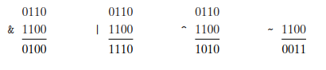

One useful application of bit vectors is to represent finite sets. We can encode any subset A ? {0, 1, . . . , w - 1} with a bit vector [aw-1, . . . , a1, a0], where ai = 1if and only if i ? A. For example, recalling that we write aw-1 on the left and a0 on the right, bit vector a = [01101001] encodes the set A = {0, 3, 5, 6}, while bit vector b = [01010101]encodes the set B = {0, 2, 4, 6}. With this way of encoding sets, Boolean operations | and & correspond to set union and intersection, respectively, and ~ corresponds to set complement. Continuing our earlier example, the operation a & b yields bit vector [01000001], while A n B = {0, 6}.

<!-- TOC --><a name="interesting"></a>
#### Interesting! 

Computers generate color pictures on a video screen or liquid crystal display by mixing three different colors of light: red, green, and blue. Imagine a simple scheme, with three different lights, each of which can be turned on or off, projecting onto a glass screen:


We can then create eight different colors based on the absence (0) or presence (1) of light sources R, G, and B:

| R G B | Color  |
| --- | --- |
| 0 0 0 | Black  |
| 0 0 1 | Blue  |
| 0 1 0 | Green  |
| 0 1 1 | Cyan  |
| 1 0 0 | Red  |
| 1 0 1 | Magenta  |
| 1 1 0 | Yellow  |
| 1 1 1 | White |

Each of these colors can be represented as a bit vector of length 3, and we can apply Boolean operations to them.

<!-- TOC --><a name="217-bit-level-operations-in-c"></a>
### 2.1.7 Bit-Level Operations in C

One useful feature of C is that it supports bitwise Boolean operations. In fact, the symbols we have used for the Boolean operations are exactly those used by C: `|` for _or_, `&` for _and_, `~` for _not_, and `^` for _exclusive-or_. These can be applied to any “integral” data type,

Here are some examples of expression evaluation for data type char:

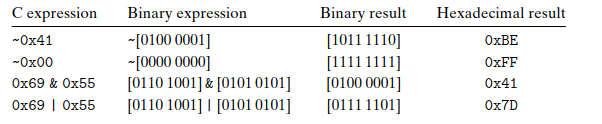

One common use of bit-level operations is to implement masking operations, where a mask is a bit pattern that indicates a selected set of bits within a word. As an example, the mask 0xFF (having ones for the least significant 8 bits) indicates the low-order byte of a word. The bit-level operation x & 0xFF yields a value consisting of the least significant byte of x, but with all other bytes set to 0. For example, with x = 0x89ABCDEF, the expression would yield 0x000000EF.

<!-- TOC --><a name="218-logical-operations-in-c"></a>
### 2.1.8 Logical Operations in C

C also provides a set of logical operators `||`, `&&`, and `!`, which correspond to the _or_, _and_, and _not_ operations of logic. These can easily be confused with the bit-level operations, but their behavior is quite different. The logical operations treat any nonzero argument as representing true and argument 0 as representing false. They return either 1 or 0, indicating a result of either true or false, respectively.

A second important distinction between the logical operators ‘&&’ and ‘||’ versus their bit-level counterparts ‘&’ and ‘|’ is that the logical operators do not evaluate their second argument if the result of the expression can be determined by evaluating the first argument. Thus, for example, the expression `a && 5/a` will never cause a division by zero, and the expression `p && *p++` will never cause the dereferencing of a null pointer. This is called **short-circuiting**

<!-- TOC --><a name="219-shift-operations-in-c"></a>
### 2.1.9 Shift Operations in C

C also provides a set of shift operations for shifting bit patterns to the left and to the right. For an operand x having bit representation [x<sub>w-1</sub>, x<sub>w-2</sub>, . . . , x<sub>0</sub>], the C expression `x << k` yields a value with bit representation [x<sub>w-k-1</sub>, x<sub>w-k-2</sub>, . . . , x<sub>0</sub>, 0, . . . , 0]. That is, x is shifted k bits to the left, dropping off the k most significant bits and filling the right end with k zeros. The shift amount should be a value between 0 and w - 1. Shift operations associate from left to right, so `x << j << k` is equivalent to `(x << j) << k`.

There is a corresponding right shift operation, written in C as x >> k, but it has a slightly subtle behavior. Generally, machines support two forms of right shift:

- Logical. A logical right shift fills the left end with k zeros, giving a result [0, . . . , 0, x<sub>w-1</sub>, x<sub>w-2</sub>, . . . x<sub>k</sub>]. 
- Arithmetic. An arithmetic right shift fills the left end with k repetitions of the most significant bit, giving a result [x<sub>w-1</sub>, . . . , x<sub>w-1</sub>, x<sub>w-1</sub>, x<sub>w-2</sub>, . . . x<sub>k</sub>]. This convention might seem peculiar, but as we will see, it is useful for operating on signed integer data.

As examples, the following table shows the effect of applying the different shift operations to two different values of an 8-bit argument x:


The C standards do not precisely de?ne which type of right shift should be used with signed numbers—either arithmetic or logical shifts may be used. This unfortunately means that any code assuming one form or the other will potentially encounter portability problems. In practice, however, almost all compiler/machine combinations use arithmetic right shifts for signed data, and many programmers assume this to be the case.

<!-- TOC --><a name="22-integer-representations"></a>
## 2.2 Integer Representations

We will describe two different ways bits can be used to encode integers:

- one that can only represent nonnegative numbers, 
- and one that can represent negative, zero, and positive numbers. 

We will see later that they are strongly related both in their mathematical properties and their machine-level implementations. We also investigate the effect of expanding or shrinking an encoded integer to fit a representation with a different length.

<!-- TOC --><a name="terminology-reference"></a>
### Terminology Reference

This is the mathematical terminology we use to define and characterize how computers encode and operate on integer data:

| Symbol | Type |  Meaning |
| --- | --- | --- |
| B2U<sub>w</sub>| Function | Binary to unsigned |
| B2T<sub>w</sub>| Function | Binary to two’s complement  |
| U2B<sub>w</sub>| Function | Unsigned to binary |
| U2T<sub>w</sub>| Function | Unsigned to two’s complement |
| T2B<sub>w</sub>| Function | Two’s complement to binary |
| T2U<sub>w</sub>| Function | Two’s complement to unsigned |
| TMin<sub>w</sub>| Constant | Minimum two’s-complement value |
| TMax<sub>w</sub>| Constant | Maximum two’s-complement value |
| UMax<sub>w</sub>| Constant | Maximum unsigned value|
| +wt | Operation | Two’s-complement addition |
| +wu | Operation | Unsigned addition 121 |
| *wt | Operation | Two’s-complement multiplication |
| *wu | Operation | Unsigned multiplication |
| -wt | Operation | Two’s-complement negation |
| -wu | Operation | Unsigned negation|

<!-- TOC --><a name="221-integral-data-types"></a>
### 2.2.1 Integral Data Types

C supports a variety of integral data types—ones that represent finite ranges of integers. Each type can specify a size with keyword `char`, `short`, `long`, as well as an indication of whether the represented numbers are all nonnegative (declared as `unsigned`), or possibly negative (the default.)

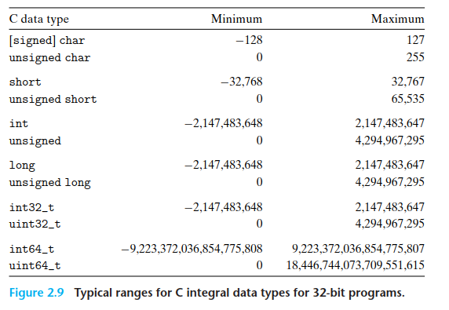
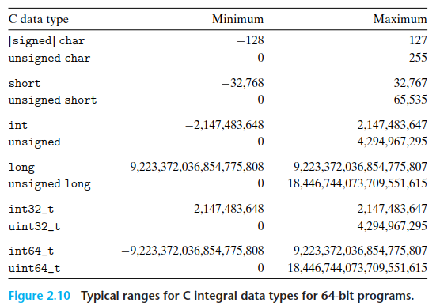

One important feature to note is that the ranges are not symmetric—the range of negative numbers extends one further than the range of positive numbers.

<!-- TOC --><a name="222-unsigned-encodings"></a>
### 2.2.2 Unsigned Encodings

<!-- TOC --><a name="principle-definition-of-unsigned-encoding"></a>
#### Principle: **Definition of unsigned encoding**

Let us consider an integer data type of _w_ bits. We write a bit vector as either x<sup>➡</sup>, to denote the entire vector, or as [x<sub>w-1</sub>, x<sub>w-2</sub>, . . . , x<sub>0</sub>] to denote the individual bits within the vector.

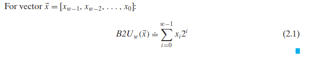
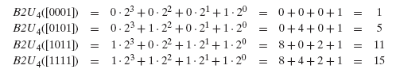

The function B2U<sub>w</sub> maps strings of zeros and ones of length _w_ to nonnegative integers.

<!-- TOC --><a name="principle-uniqueness-of-unsigned-encoding"></a>
#### Principle: **Uniqueness of unsigned encoding**

The unsigned binary representation has the important property that every number between 0 and 2 _w_ − 1 has a unique encoding as a  _w_-bit value.

Function B2U<sub>w</sub> is a bijection. The mathematical term bijection refers to a function f that goes two ways; in this case, the function B2U<sub>w</sub> maps each bit vector of length w to a unique number between 0 and 2 _w_ − 1, and it has an inverse, which we call U2B<sub>w</sub> (for “unsigned to binary”), that maps each number in the range 0 to 2 _w_ − 1 to a unique pattern of _w_ bits.

<!-- TOC --><a name="223-twos-complement"></a>
### 2.2.3 Two's Complement 

The most common computer representation of signed numbers is known as two’s-complement form. This is defined by interpreting the most significant bit of the word to have negative weight. We express this interpretation as a function B2T<sub>w</sub> (for “binary to two’s complement” length w):

<!-- TOC --><a name="principle-definition-of-twos-complement-encoding"></a>
#### Principle: **Definition of two's-complement encoding**

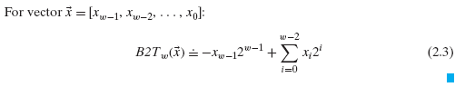

The most significant bit xw-1 is also called the sign bit. Its “weight” is -2<sup>w-1</sup>, the negation of its weight in an unsigned representation. When the sign bit is set to 1, the represented value is negative, and when set to 0, the value is nonnegative.

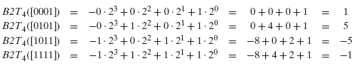

The least representable value is given by bit vector [1,0 . . . 0] (set the bit with negative weight but clear all others), having integer value TMin<sub>w</sub> = -2<sup>w-1</sup>. The greatest value is given by bit vector [0,1 . . . 1] (clear the bit with negative weight but set all others), having integer value 2<sup>w-1</sup> -1.

Every number within the representable range has a unique encoding as a _w_-bit two’s-complement number:

<!-- TOC --><a name="principle-uniqueness-of-twos-complement-encoding"></a>
#### Principle: **Uniqueness of two's complement encoding**

Function B2Tw is a bijection. 

We define function T2B<sub>w</sub> (for two's complement to binary) to be the inverse of B2T<sub>w</sub>. That is, for a number x, such that TMin<sub>w</sub> . x . TMax<sub>w</sub>, T2B<sub>w</sub>(x) is the (unique) _w_-bit pattern that encodes x.

Some points to highlight:

The two’s-complement range is asymmetric: |_TMin_| = |_TMax_| + 1; that is, there is no positive counterpart to _TMin_. This leads to some peculiar properties of two’s-complement arithmetic and can be the source of subtle program bugs. The reason is that 0 is included in the nonnegative (so we have one less positive)

Second, the maximum unsigned value is just over twice the maximum two’s-complement value: _UMax_ = _2TMax_ + 1. All of the bit patterns that denote negative numbers in two’s-complement notation become positive values in an unsigned representation.

>For some programs, it is essential that data types be encoded using representations with specific sizes. For example, when writing programs to enable a machine to communicate over the Internet according to a standard protocol, it is important to have data types compatible with those specified by the protocol.

The C standards do not require signed integers to be represented in two’s complement form, but nearly all machines do so. Programmers who are concerned with maximizing portability across all possible machines should not assume any particular range of representable values, nor should they assume any particular representation of signed numbers. On the other hand, many programs are written assuming a two’s-complement representation of signed numbers, and the “typical” ranges shown in Figures 2.9 and 2.10, and these programs are portable across a broad range of machines and compilers.

<!-- TOC --><a name="224-conversions-between-signed-and-unsigned"></a>
### 2.2.4 Conversions between Signed and Unsigned

C allows casting between different numeric data types. For example, suppose variable x is declared as int and u as unsigned. The expression (unsigned) x converts the value of x to an unsigned value, and (int) u converts the value of u to a signed integer.

The effect of casting is to keep the bit values identical but change how these bits are interpreted. The underlying bit representation stays the same. This is a general rule for how most C implementations handle conversions between signed and unsigned numbers with the same word size—the numeric values might change, but the bit patterns do not.

<!-- TOC --><a name="principle-conversions-from-twos-complement-to-unsigned"></a>
#### Principle: **Conversions from two's complement to unsigned**

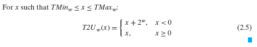

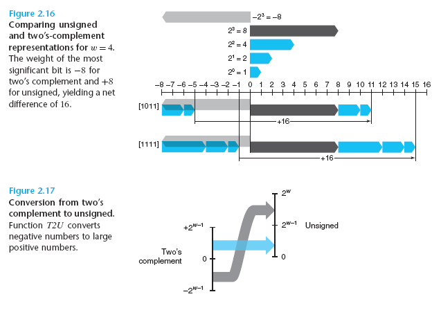

As it shows, when mapping a signed number to its unsigned counterpart, negative numbers are converted to large positive numbers, while nonnegative numbers remain unchanged.

<!-- TOC --><a name="principle-conversion-from-unsigned-to-twos-complement"></a>
#### Principle: **Conversion from unsigned to two's complement**

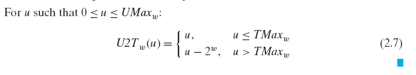


To summarize, we considered the effects of converting in both directions between unsigned and two's-complement representations. For values x in the range 0 ≤ x ≤ TMax<sub>w</sub>, we have T2U<sub>w</sub>(x) = x and U2T<sub>w</sub>(x) = x. That is, numbers in this range have identical unsigned and two's-complement representations. For values outside of this range, the conversions either add or subtract 2<sup>w</sup>.

<!-- TOC --><a name="225-signed-versus-unsigned-in-c"></a>
### 2.2.5 Signed versus Unsigned in C

C supports both signed and unsigned arithmetic for all of its integer data types. Although the C standard does not specify a particular representation of signed numbers, almost all machines use two’s complement. Generally, most numbers are signed by default.

C allows conversion between unsigned and signed; most systems follow the rule that the underlying bit representation does not change.

This rule has the effect of applying the function U2T<sub>w</sub> when converting from unsigned to signed, and T2U<sub>w</sub> when converting from signed to unsigned, where w is the number of bits for the data type.

Conversions can happen due to explicit casting:

```c
int tx, ty; 
unsigned ux, uy; 

tx = (int) ux; 
uy = (unsigned) ty;
```

Alternatively, they can happen implicitly when an expression of one type is assigned to a variable of another:

```c
int tx, ty;
unsigned ux, uy;

tx = ux; /* Cast to signed */
uy = ty; /* Cast to unsigned */
```

<!-- TOC --><a name="226-expanding-the-bit-representation-of-a-number"></a>
### 2.2.6 Expanding the Bit Representation of a Number

One common operation is to convert between integers having different word sizes while retaining the same numeric value. Of course, this may not be possible when
the destination data type is too small to represent the desired value. Converting from a smaller to a larger data type, however, should always be possible.

To convert an unsigned number to a larger data type, we can simply add leading zeros to the representation; this operation is known as zero extension:

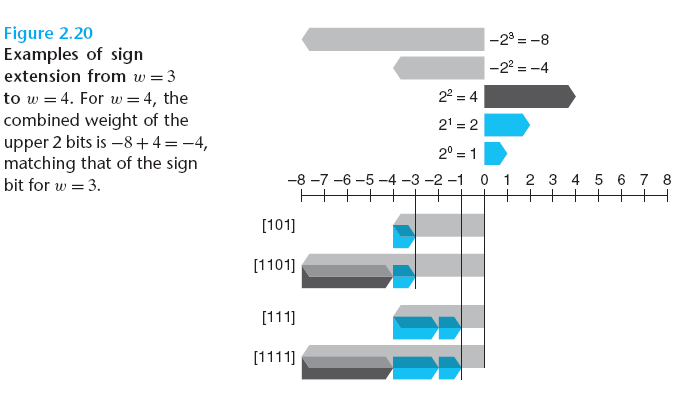

<!-- TOC --><a name="principle-expansion-of-an-unsigned-number-by-_zero_-extension"></a>
#### Principle: Expansion of an unsigned number by _zero_ extension

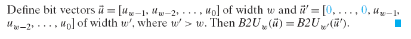

<!-- TOC --><a name="principle-expansion-of-a-twos-complement-number-by-_sign_-extension"></a>
#### Principle: Expansion of a two's-complement number by _sign_ extension

For converting a two’s-complement number to a larger data type, the rule is to perform a sign extension, adding copies of the most significant bit to the representation, expressed by the following principle:

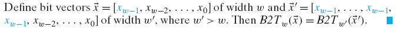

Sign extension preserves the value of a two’s-complement number.

<!-- TOC --><a name="227-truncating-numbers"></a>
### 2.2.7 Truncating Numbers

If we reduce the number of bits that represent a number, rather than extending a value with extra bits, we are **truncating** the number.

This can happen when, for instance, we cast `x` to be `short`, truncating a 32-bit `int` to a 16-bit `short`:

```c
int x = 53191;
short sx = (short) x; /* -12345 */
int y = sx; /* -12345 */
```

When truncating a _w_-bit number _x→_ = [x<sub>w-1</sub>, x<sub>w-2</sub>, . . . , x<sub>0</sub>] to a _k_-bit number, we drop the high-order _w - k_ bits, giving a bit vector _x→'_ = [x<sub>k-1</sub>, x<sub>k-2</sub>, . . . , x<sub>0</sub>].

Truncating a number can alter its value—a form of overflow. For an unsigned number, we can readily characterize the numeric value that will result.

<!-- TOC --><a name="principle-truncation-of-an-unsigned-number"></a>
#### Principle: **Truncation of an unsigned number**

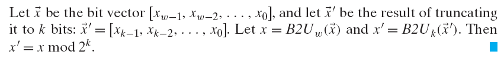

The intuition behind this principle is simply that all of the bits that were truncated have weights of the form 2i , where i ≥ k, and therefore each of these weights reduces to zero under the modulus operation.

<!-- TOC --><a name="principle-truncation-of-a-twos-complement-number"></a>
#### Principle: **Truncation of a two's-complement number**

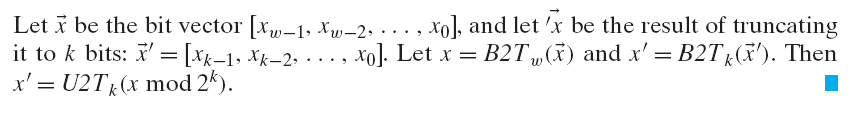

In this formulation, x mod 2<sup>k</sup> will be a number between 0 and 2<sup>k - 1</sup>. Applying function U2T<sub>k</sub> to it will have the effect of converting the most significant bit x<sup>k - 1</sup> from having weight 2<sup>k - 1</sup> to having weight −2<sup>k - 1</sup>.

<!-- TOC --><a name="228-advice-on-signed-versus-unsigned"></a>
### 2.2.8 Advice on Signed versus Unsigned

As we have seen, the implicit casting of signed to unsigned leads to some nonintuitive behavior. Nonintuitive features often lead to program bugs, and ones involving the nuances of implicit casting can be especially difficult to see. Since the casting takes place without any clear indication in the code, programmers often overlook its effects.

One way to avoid such bugs is to never use unsigned numbers. In fact, few languages other than C support unsigned integers.

Unsigned values are very useful when we want to think of words as just collections of bits with no numeric interpretation. This occurs, for example, when packing a word with flags describing various Boolean conditions. Addresses are naturally unsigned, so systems programmers find unsigned types to be helpful. Unsigned values are also useful when implementing mathematical packages for
modular arithmetic and for multiprecision arithmetic, in which numbers are represented by arrays of words.

<!-- TOC --><a name="23-integer-arithmetic"></a>
## 2.3 Integer Arithmetic

It's important to consider the **artifacts of the finite computer arithmetic**. Understanding the nuances of computer arithmetic can help programmers write more reliable code. For example, adding two positive numbers can yield a negative result, and that the comparison `x < y` can yield a different result than the comparison `x-y < 0`.

<!-- TOC --><a name="231-unsigned-addition"></a>
### 2.3.1 Unsigned Addition

<!-- TOC --><a name="principle-unsigned-addition"></a>
#### Principle: **Unsigned addition**

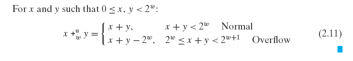

The normal case preserves the value of x + y, while the overflow case has the effect of decrementing this sum by 2<sub>w</sub>.

An arithmetic operation is said to overflow when the full integer result cannot fit within the word size limits of the data type.

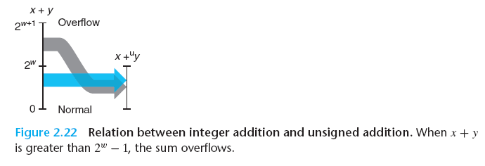

<!-- TOC --><a name="principle-detecting-overflow-of-unsigned-addition"></a>
#### Principle: **Detecting overflow of unsigned addition**

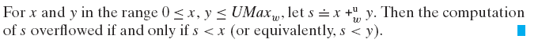

>Modular addition forms a mathematical structure known as an **abelian** group, named after the Norwegian mathematician Niels Henrik Abel (1802–1829). That is, it is commutative (that’s where the “abelian” part comes in) and associative; it has an identity element 0, and every element has an additive inverse.

<!-- TOC --><a name="principle-unsigned-negation"></a>
#### Principle: **Unsigned negation**

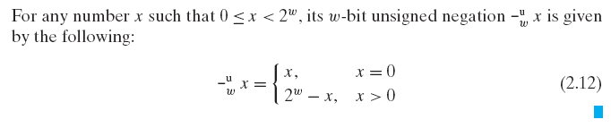

<!-- TOC --><a name="232-twos-complement-addition"></a>
### 2.3.2 Two's-Complement Addition

With two’s-complement addition, we must decide what to do when the result is either too large (positive) or too small (negative) to represent.

We avoid ever-expanding data sizes by truncating the representation to _w_ bits.

<!-- TOC --><a name="principle-twos-complement-addition"></a>
#### Principle: **Two's complement addition**

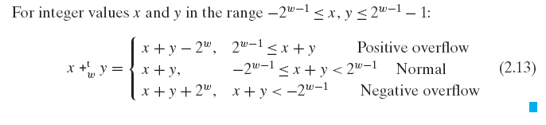

When the sum x + y exceeds TMax<sub>w</sub> (case 4), we say that positive overflow has occurred. In this case, the effect of truncation is to subtract 2<sub>w</sub> from the sum. When the sum x + y is less than TMin<sub>w</sub> (case 1), we say that negative overflow has occurred. In this case, the effect of truncation is to add 2<sub>w</sub> to the sum. The w-bit two’s-complement sum of two numbers has the exact same bit-level representation as the unsigned sum. In fact, most computers use the same machine instruction to perform either unsigned or signed addition:

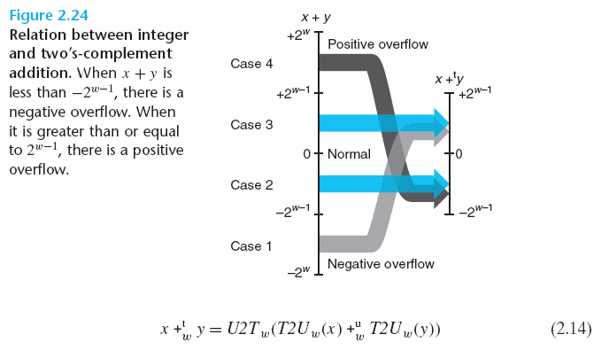

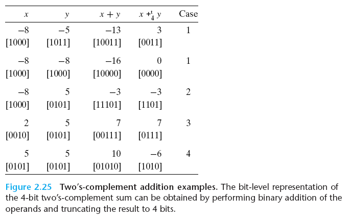

<!-- TOC --><a name="principle-detecting-overflow-in-twos-complement-addition"></a>
#### Principle: **Detecting overflow in two's-complement addition**


<!-- TOC --><a name="233-twos-complement-negation"></a>
### 2.3.3 Two's-Complement Negation

We can see that every number x in the range TMin<sub>w</sub> ≤ x ≤ TMax<sub>w</sub> has an additive inverse under +tw, which we denote -tw x as follows:

<!-- TOC --><a name="principle-twos-complement-negation"></a>
#### Principle: **Two's complement negation**

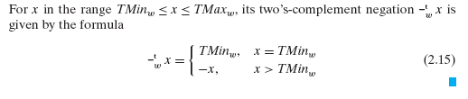

That is, for w-bit two’s-complement addition, TMin<sub>w</sub> is its own additive inverse, while any other value x has −x as its additive inverse.

<!-- TOC --><a name="234-unsigned-multiplication"></a>
### 2.3.4 Unsigned Multiplication

<!-- TOC --><a name="principle-unsigned-multiplicaiton"></a>
#### Principle: **Unsigned multiplicaiton**

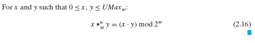

Integers x and y in the range 0 ≤ x, y ≤ 2<sup>w</sup> − 1 can be represented as w-bit unsigned numbers, but their product x . y can range between 0 and (2<sup>w</sup> − 1)<sup>2</sup> = 2<sup>2w</sup> − 2<sup>w + 1</sup> + 1. This could require as many as 2w bits to represent. Instead, unsigned multiplication in C is defined to yield the w-bit value given by the low-order w bits of the 2w-bit integer product.

Truncating an unsigned number to w bits is equivalent to computing its value modulo 2<sup>w</sup>:

<!-- TOC --><a name="235-twos-complement-multiplication"></a>
### 2.3.5 Two's Complement Multiplication

<!-- TOC --><a name="principle-twos-complement-multiplication"></a>
#### Principle: **Two's complement multiplication**

Signed multiplication in C generally is performed by truncating the 2w-bit product to w bits.

We denote this value as x *tw y. Truncating a two’s-complement number to w bits is equivalent to first computing its value modulo 2<sup>2</sup> and then converting from unsigned to two’s complement:

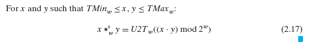

<!-- TOC --><a name="principle-bit-level-equivalence-of-unsigned-and-twos-complement-multiplication"></a>
#### Principle: **Bit-level equivalence of unsigned and two's complement multiplication**

The bit-level representation of the product operation is identical for both unsigned and two’s-complement multiplication

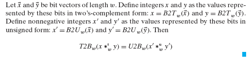

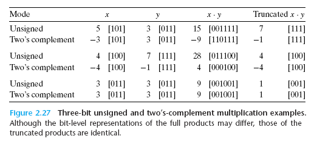

<!-- TOC --><a name="236-multiplying-by-constants"></a>
### 2.3.6 Multiplying by Constants

Historically, the integer multiply instruction on many machines was fairly slow, requiring 10 or more clock cycles, whereas other integer operations—such as addition, subtraction, bit-level operations, and shifting—required only 1 clock cycle. As a consequence, one important optimization used by compilers is to attempt to replace multiplications by constant factors with combinations of shift and addition operations. 

We will first consider the case of multiplying by a power of 2, and then we will generalize this to arbitrary constants.

<!-- TOC --><a name="principle-multiplication-by-a-power-of-2"></a>
#### Principle: **Multiplication by a power of 2**

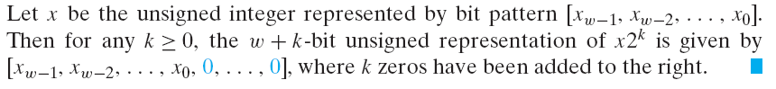

So, for example, 11 can be represented for w = 4 as [1011]. Shifting this left by k = 2 yields the 6-bit vector [101100], which encodes the unsigned number 11 . 4 = 44.

<!-- TOC --><a name="principle-unsigned-multiplication-by-a-power-of-2"></a>
#### Principle: **Unsigned multiplication by a power of 2**

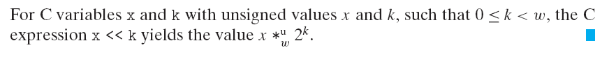

Note that multiplying by a power of 2 can cause overflow with either unsigned or two’s-complement arithmetic. Our result shows that even then we will get the same effect by shifting. Returning to our earlier example, we shifted the 4-bit pattern [1011] (numeric value 11) left by two positions to get [101100] (numeric value 44). Truncating this to 4 bits gives [1100] (numeric value 12 = 44 mod 16).

Given that integer multiplication is more costly than shifting and adding, many C compilers try to remove many cases where an integer is being multiplied by a constant with combinations of shifting, adding, and subtracting.

Of course, the trade-off between using combinations of shifting, adding, and subtracting versus a single multiplication instruction depends on the relative speeds of these instructions, and these can be highly machine dependent. Most compilers only perform this optimization when a small number of shifts, adds, and subtractions suffice.

<!-- TOC --><a name="237-dividing-by-powers-of-2"></a>
### 2.3.7 Dividing by Powers of 2

Integer division on most machines is even slower than integer multiplication— requiring 30 or more clock cycles. Dividing by a power of 2 can also be performed using shift operations, but we use a right shift rather than a left shift. The two different right shifts—logical and arithmetic—serve this purpose for unsigned and two’s-complement numbers, respectively.

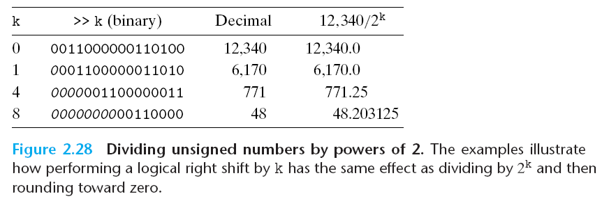

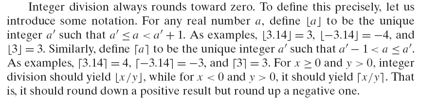

<!-- TOC --><a name="principle-unsigned-division-by-a-power-of-2"></a>
#### Principle: **Unsigned division by a power of 2**

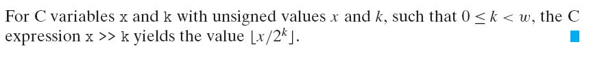

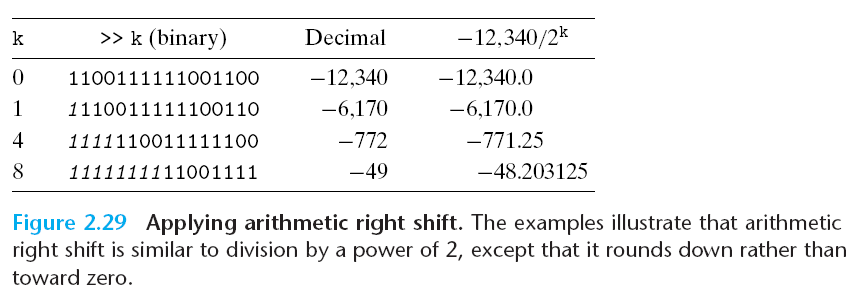

The case for dividing by a power of 2 with two’s-complement arithmetic is slightly more complex. First, the shifting should be performed using an arithmetic right shift, to ensure that negative values remain negative.

<!-- TOC --><a name="principle-twos-complement-division-by-a-power-of-2-rounding-down"></a>
#### Principle: **Two’s-complement division by a power of 2, rounding down**

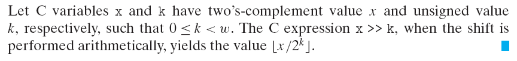

We can correct for the improper rounding that occurs when a negative number is shifted right by “biasing” the value before shifting.

<!-- TOC --><a name="principle-twos-complement-division-by-a-power-of-2-rounding-up"></a>
#### Principle: **Two’s-complement division by a power of 2, rounding up** 

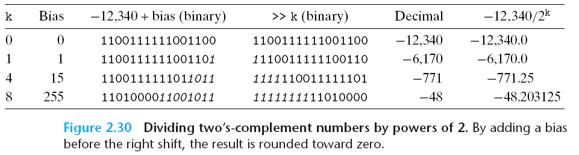

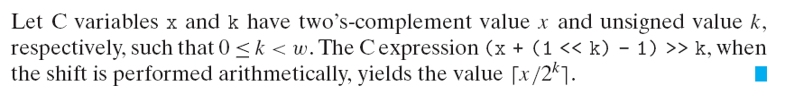

Figure 2.30 demonstrates how adding the appropriate bias before performing the arithmetic right shift causes the result to be correctly rounded.

We now see that division by a power of 2 can be implemented using logical or arithmetic right shifts. This is precisely the reason the two types of right shifts are available on most machines. Unfortunately, this approach does not generalize to
division by arbitrary constants. Unlike multiplication, we cannot express division by arbitrary constants K in terms of division by powers of 2.

<!-- TOC --><a name="238-final-thought-on-integer-arithmetic"></a>
### 2.3.8 Final Thought on Integer Arithmetic

The “integer” arithmetic performed by computers is really a form of modular arithmetic. The finite word size used to represent numbers limits the range of possible values, and the resulting operations can overflow.

The two’s-complement representation provides a clever way to represent both negative and positive values, while using the same bit-level implementations as are used to perform unsigned arithmetic—operations such as addition, subtraction, multiplication, and even division have either identical or very similar bit-level behaviors, whether the operands are in unsigned or two’s complement form.

Some of the conventions in the C language can yield some surprising results, and these can be sources of bugs that are hard to recognize or understand. We have especially seen that the `unsigned` data type, while conceptually straightforward, can lead to behaviors that even experienced programmers do not expect. We have also seen that this data type can arise in unexpected ways—for example, when writing integer constants and when invoking library routines.

<!-- TOC --><a name="24-floating-point"></a>
## 2.4 Floating Point

A floating-point representation encodes rational numbers of the form V = x × 2y. It is useful for performing computations involving very large numbers (|V| >> 0), numbers very close to 0 (|V| << 1), and more generally as an approximation to real arithmetic.

Up until the 1980s, every computer manufacturer devised its own conventions for how floating-point numbers were represented and the details of the operations performed on them. In addition, they often did not worry too much about the accuracy of the operations, viewing speed and ease of implementation as being more critical than numerical precision.

All of this changed around 1985 with the advent of IEEE Standard 754, a carefully crafted standard for representing floating-point numbers and the operations performed on them. This effort started in 1976 under Intel’s sponsorship with the design of the 8087, a chip that provided floating-point support for the 8086 processor. Intel hired William Kahan, a professor at the University of California, Berkeley, as a consultant to help design a floating-point standard for its future processors. They allowed Kahan to join forces with a committee generating an industry-wide standard under the auspices of the Institute of Electrical and Electronics Engineers (IEEE). The committee ultimately adopted a standard close to the one Kahan had devised for Intel. Nowadays, virtually all computers support what has become known as IEEE floating point. This has greatly improved the portability of scientific application programs across different machines.

>The Institute of Electrical and Electronics Engineers (IEEE—pronounced “eye-triple-ee”) is a professional society that encompasses all of electronic and computer technology. It publishes journals, sponsors conferences, and sets up committees to define standards on topics ranging from power transmission to software engineering. Another example of an IEEE standard is the 802.11 standard for wireless networking.

<!-- TOC --><a name="241-fractional-binary-numbers"></a>
### 2.4.1 Fractional Binary Numbers

Decimal notation uses a representation of the form:

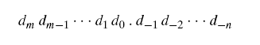

where each decimal digit d<sub>i</sub> ranges between 0 and 9. This notation represents a value d defined as

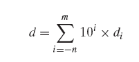

The weighting of the digits is defined relative to the decimal point symbol (‘.’), meaning that digits to the left are weighted by nonnegative powers of 10, giving integral values, while digits to the right are weighted by negative powers of 10, giving fractional values.

For example, 12.3410 represents the number 1 × 10<sup>1</sup> + 2 × 10<sup>0</sup> + 3 × 10<sup>-1</sup> + 4 × 10<sup>-2</sup> = 12 34/100 .

By analogy, consider a notation of the form

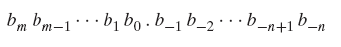

where each binary digit, or bit, b<sub>i</sub> ranges between 0 and 1:

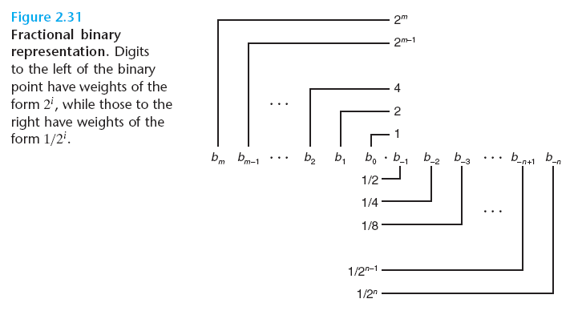

This notation represents a number b defined as

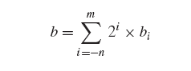

The symbol ‘.’ now becomes a binary point, with bits on the left being weighted by nonnegative powers of 2, and those on the right being weighted by negative powers of 2.

For example, 101.112 represents the number 1× 2<sup>2</sup> + 0 × 2<sup>1</sup> + 1× 2<sup>0</sup> + 1× 2<sup>-1</sup> + 1× 2<sup>-2</sup> = 4 + 0 + 1+ 1/2 + 1/4 = 5 3/4 .

Shifting the binary point one position to the left has the effect of dividing the number by 2.

Note that numbers of the form 0.11 . . . 1<sub>2</sub> represent numbers just below 1.

Assuming we consider only finite-length encodings, decimal notation cannot represent numbers such as 1/3 and 5/7 exactly. Similarly, fractional binary notation can only represent numbers that can be written x × 2<sup>y</sup>. Other values can only be approximated. For example, the number 1/5 can be represented exactly as the fractional decimal number 0.20. As a fractional binary number, however, we cannot represent it exactly and instead must approximate it with increasing accuracy by lengthening the binary representation:

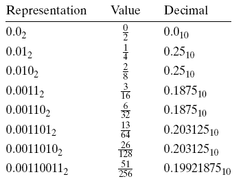

<!-- TOC --><a name="242-iee-floating-point-representation"></a>
### 2.4.2 IEE Floating-Point Representation

Positional notation such as considered in the previous section would not be efficient for representing very large numbers. For example, the representation of 5 × 2<sup>100</sup> would consist of the bit pattern 101 followed by 100 zeros. Instead, we would like to represent numbers in a form x × 2<sup>y</sup> by giving the values of x and y.

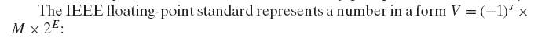

- The _sign s_ determines whether the number is negative (s = 1) or positive (s = 0), where the interpretation of the sign bit for numeric value 0 is handled as a special case. 
- The _significand M_ is a fractional binary number that ranges either between 1 and 2 - ε or between 0 and 1- ε.
- The _exponent E_ weights the value by a (possibly negative) power of 2.

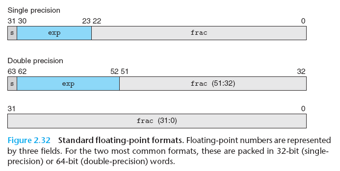

The bit representation of a floating-point number is divided into three fields to
encode these values:

- The single sign bit `s` directly encodes the sign _s_.
- The k-bit exponent field `exp` = e<sub>k-1</sub> . . . e<sub>1</sub>e<sub>0</sub> encodes the exponent _E_.
- The n-bit fraction field `frac` = f<sub>n-1</sub> . . . f<sub>1</sub>f<sub>0</sub> encodes the _significand M_, but the value encoded also depends on whether or not the exponent field equals 0.

The value encoded by a given bit representation can be divided into three different cases (the latter having two variants), depending on the value of exp:

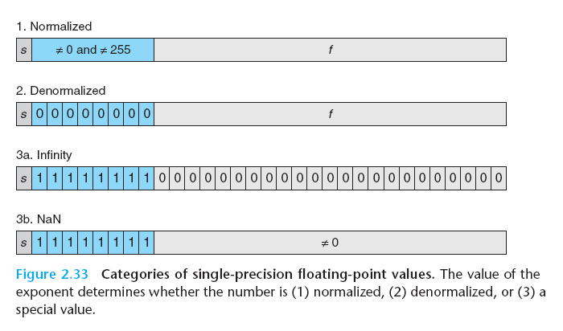

<!-- TOC --><a name="case-1-normalized-values"></a>
#### Case 1: Normalized Values

This is the most common case. It occurs when the bit pattern of exp is neither all zeros (numeric value 0) nor all ones (numeric value 255 for single precision, 2047 for double). 

- The exponent field is interpreted as representing a signed integer in **biased** form. That is, the exponent value is E = e - Bias, where e is the unsigned number having bit representation e<sub>k-1</sub> . . . e<sub>1</sub>e<sub>0</sub> and Bias is a bias value equal to 2<sup>k-1</sup> - 1 (127 for single precision and 1023 for double). This yields exponent ranges from -126 to +127 for single precision and -1022 to +1023 for double precision.

- The fraction field `frac` is interpreted as representing the fractional value f , where 0 <= f < 1, having binary representation 0.f<sup>n-1</sup> . . . f<sup>1</sup>f<sup>0</sup>, that is, with the binary point to the left of the most significant bit. The significand is defined to be M = 1 + f . 

<!-- TOC --><a name="case-2-denormalized-values"></a>
#### Case 2: Denormalized Values

When the exponent field is all zeros, the represented number is in denormalized form. In this case, the exponent value is E = 1 - Bias, and the significand value is M = f, that is, the value of the fraction field without an implied leading 1.

- Denormalized numbers serve two purposes. First, they provide a way to represent numeric value 0, since with a normalized number we must always have M . 1, and hence we cannot represent 0. In fact, the floating-point representation of +0.0 has a bit pattern of all zeros: the sign bit is 0, the exponent field is all zeros (indicating a denormalized value), and the fraction field is all zeros, giving M = f = 0.

- Denormalized numbers serve two purposes. First, they provide a way to represent numeric value 0, since with a normalized number we must always have M . 1, and hence we cannot represent 0. In fact, the floating-point representation of +0.0 has a bit pattern of all zeros: the sign bit is 0, the exponent field is all zeros (indicating a denormalized value), and the fraction field is all zeros, giving M = f = 0. (Curiously, when the sign bit is 1, but the other fields are all zeros, we get the value -0.0)

<!-- TOC --><a name="case-3-special-values"></a>
#### Case 3: Special Values

A final category of values occurs when the exponent field is all ones. When the fraction field is all zeros, the resulting values represent infinity, either +∞ when s = 0 or -∞ when s = 1. Infinity can represent results that overflow, as when we multiply two very large numbers, or when we divide by zero. When the fraction field is nonzero, the resulting value is called a **NaN**, short for Not a Number. Such values are returned as the result of an operation where the result cannot be given as a real number or as infinity, as when computing the square root of -1 or -∞. They can also be useful in some applications for representing uninitialized data.

<!-- TOC --><a name="243-example-numbers"></a>
### 2.4.3 Example Numbers

<!-- TOC --><a name="244-rounding"></a>
### 2.4.4 Rounding

Floating-point arithmetic can only approximate real arithmetic, since the representation has limited range and precision. Thus, for a value x, we generally want a systematic method of finding the “closest” matching value x' that can be represented in the desired floating-point format. This is the task of the **rounding operation**. 

One key problem is to define the direction to round a value that is halfway between two possibilities.

The IEEE floating-point format defines four different rounding modes. The default method finds a closest match, while the other three can be used for computing upper and lower bounds.

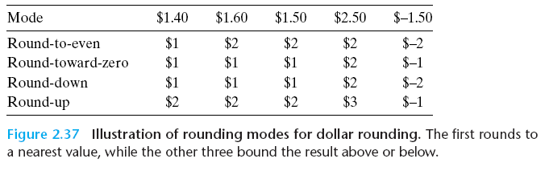

- Round-to-even (also called round-to-nearest) is the default mode. It attempts to find a closest match. Round-to-even mode adopts the convention that it rounds the number either upward or downward such that the least significant digit of the result is even. Thus, it rounds both $1.50 and $2.50 to $2.

Rounding toward even numbers avoids a statistical bias in most real-life situations. It will round upward about 50% of the time and round downward about 50% of the time.

Round-to-even rounding can be applied even when we are not rounding to a whole number. We simply consider whether the least significant digit is even or odd.

Round-to-even rounding can be applied to binary fractional numbers. We consider least significant bit value 0 to be even and 1 to be odd. In general, the rounding mode is only significant when we have a bit pattern of the form XX . . . X.Y Y . . . Y100 . . ., where X and Y denote arbitrary bit values with the rightmost Y being the position to which we wish to round. Only bit patterns of this form denote values that are halfway between two possible results.

The other three modes produce guaranteed bounds on the actual value. These can be useful in some numerical applications.

- Round-toward-zero mode rounds positive numbers downward and negative numbers upward, giving a value ˆx such that |ˆx| <= |x|.
- Round-down mode rounds both positive and negative numbers downward, giving a value x − such that x − ≤ x. 
- Round-up mode rounds both positive and negative numbers upward, giving a value x + such that x ≤ x+.

<!-- TOC --><a name="245-floating-point-operations"></a>
### 2.4.5 Floating Point Operations

The IEEE standard specifies a simple rule for determining the result of an arithmetic operation ☉ such as addition or multiplication. Viewing floating-point values x and y as real numbers, and some operation defined over real numbers, the computation should yield Round(x ☉ y), the result of applying rounding to the exact result of the real operation.

In practice, there are clever tricks floating-point unit designers use to avoid performing this exact computation, since the  computation need only be sufficiently precise to guarantee a correctly rounded result.

One strength of the IEEE standard’s method of specifying the behavior of floating-point operations is that it is independent of any particular hardware or software realization.

<!-- TOC --><a name="floating-point-addition"></a>
#### Floating-point addition

Addition over real numbers also forms an abelian group, but we must consider what effect rounding has on these properties.

Let us define x +f y to be Round(x + y). This operation is defined for all values of x and y, although it may yield infinity even when both x and y are real numbers due to overflow. The operation **is commutative**, with x +f y = y +f x for all values of x and y. **On the other hand, the operation is not associative**.

>The lack of associativity in floating-point addition is the most important group property that is lacking. It has important implications for scientific programmers and compiler writers.

Suppose a compiler is given the following code fragment:

```
x = a + b + c;
y = b + c + d; 
```

The compiler might be tempted to save one floating-poing addition by generating the following code:

```
t = b + c;
x = a + t;
y = t + d;
```

However, this computation might yield a different value for x than would the original, since it uses a different association of the addition operations. In most applications, the difference would be so small as to be inconsequential. Unfortunately, compilers have no way of knowing what trade-offs the user is willing to make between efficiency and faithfulness to the exact behavior of the original program. As a result, they tend to be very conservative, avoiding any optimizations that could have even the slightest effect on functionality.

Onthe other hand, floating-point addition satisfies the following monotonicity property: if a ≥ b, then x +f a ≥ x +f b for any values of a, b, and x other than NaN. This property of real (and integer) addition is not obeyed by unsigned or two’scomplement
addition.

<!-- TOC --><a name="floating-point-multiplication"></a>
#### Floating-point Multiplication

Floating-point multiplication also obeys many of the properties one normally associates with multiplication. Let us define x *f y to be Round(x × y). This operation is closed under multiplication (although possibly yielding infinity or NaN), it is commutative, and it has 1.0 as a multiplicative identity. On the other hand, **it is not associative**, due to the possibility of overflow or the loss of precision due to rounding.

Floating-point multiplication does not distribute over addition (For example, with single-precision floating point, the expression `1e20*(1e20-1e20)` evaluates to `0.0`, while `1e20*1e20-1e20*1e20` evaluates to `NaN`.)

Floating-point multiplication satisfies the following monotonicity properties for any values of a, b, and c other than NaN:

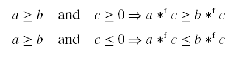

We are also guaranteed that a *f a ≥ 0, as long as a != NaN. As we saw earlier, none of these monotonicity properties hold for unsigned or two’s complement multiplication.

>This lack of associativity and distributivity is of serious concern to scientific programmers and to compiler writers. Even such a seemingly simple task as writing code to determine whether two lines intersect in three-dimensional space can be a major challenge.

<!-- TOC --><a name="246-floating-point-in-c"></a>
### 2.4.6 Floating Point in C

All versions of C provide two different floating-point data types: float and double. On machines that support IEEE floating point, these data types correspond to single- and double-precision floating point. In addition, the machines use the round-to-even rounding mode.

Unfortunately, since the C standards do not require the machine to use IEEE floating point, there are no standard methods to change the rounding mode or to get special values such as -0, +Inf, -Inf, or NaN. Most systems provide a combination of include (`.h`) files and procedure libraries to provide access to these features, but the details vary from one system to another.

<!-- TOC --><a name="casting-rules-in-c-for-type-int-being-32-bits"></a>
#### Casting rules in C (for type `int` being 32 bits)

- From int to float, the number cannot overflow, but it may be rounded. 
- From int or float to double, the exact numeric value can be preserved because double has both greater range (i.e., the range of representable values), as well as greater precision (i.e., the number of significant bits). 
- From double to float, the value can overflow to +Inf or -Inf, since the range is smaller. Otherwise, it may be rounded, because the precision is smaller. 
- From float or double to int, the value will be rounded toward zero. For example, 1.999 will be converted to 1, while -1.999 will be converted to -1. Furthermore, the value may overflow. The C standards do not specify a fixed result for this case. Intel-compatible microprocessors designate the bit pattern [10 . . . 00] (TMin<sub>w</sub> for word size w) as an **integer indefinite** value. Any conversion from floating point to integer that cannot assign a reasonable integer approximation yields this value. Thus, the expression `(int) +1e10` yields `-21483648`, generating a negative value from a positive one.

<!-- TOC --><a name="25-summary"></a>
## 2.5 Summary

Computers encode information as bits, generally organized as sequences of bytes. Different encodings are used for representing integers, real numbers, and character strings. Different models of computers use different conventions for encoding numbers and for ordering the bytes within multi-byte data. 

The C language is designed to accommodate a wide range of different implementations in terms of word sizes and numeric encodings. Machines with 64-bit word sizes have become increasingly common, replacing the 32-bit machines that dominated the market for around 30 years. Because 64-bit machines can also run programs compiled for 32-bit machines, we have focused on the distinction between 32- and 64-bit programs, rather than machines. The advantage of 64-bit programs is that they can go beyond the 4 GB address limitation of 32-bit programs. 

Most machines encode signed numbers using a two’s-complement representation and encode floating-point numbers using IEEE Standard 754. Understanding these encodings at the bit level, as well as understanding the mathematical characteristics of the arithmetic operations, is important for writing programs that operate correctly over the full range of numeric values.

When casting between signed and unsigned integers of the same size, most C implementations follow the convention that the underlying bit pattern does not change. On a two’s-complement machine, this behavior is characterized by functions T2Uw and U2Tw, for aw-bit value. The implicit casting ofCgives results that many programmers do not anticipate, often leading to program bugs. 

Due to the finite lengths of the encodings, computer arithmetic has properties quite different from conventional integer and real arithmetic. The finite length can cause numbers to overflow, when they exceed the range of the representation. Floating-point values can also underflow, when they are so close to 0.0 that they are changed to zero.

The finite integer arithmetic implemented by C, as well as most other programming languages, has some peculiar properties compared to true integer arithmetic. For example, the expression `x * x` can evaluate to a negative number due to overflow. Nonetheless, both unsigned and two’s-complement arithmetic satisfy many of the other properties of integer arithmetic, including associativity, commutativity, and distributivity. This allows compilers to do many optimizations. For example, in replacing the expression `7*x` by `(x<<3)-x`, we make use of the associative, commutative, and distributive properties, along with the relationship between shifting and multiplying by powers of 2.

We have seen several clever ways to exploit combinations of bit-level operations and arithmetic operations. For example, we saw that with two’s-complement arithmetic, ~x+1 is equivalent to -x. As another example, suppose we want a bit pattern of the form [0, . . . , 0, 1, . . . , 1], consisting of w - k zeros followed by k ones. Such bit patterns are useful for masking operations. This pattern can be generated by the C expression `(1<<k)-1`, exploiting the property that the desired bit pattern has numeric value 2<sup>k</sup> - 1. For example, the expression `(1<<8)-1` will generate the bit pattern 0xFF.

Floating-point representations approximate real numbers by encoding numbers of the form x × 2<sup>y</sup>. IEEE Standard 754 provides for several different precisions, with the most common being single (32 bits) and double (64 bits). IEEE floating point also has representations for special values representing plus and minus infinity, as well as not-a-number.

Floating-point arithmetic must be used very carefully, because it has only limited range and precision, and because it does not obey common mathematical properties such as associativity.