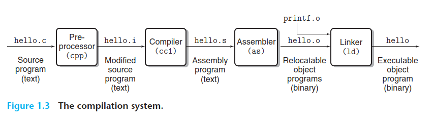
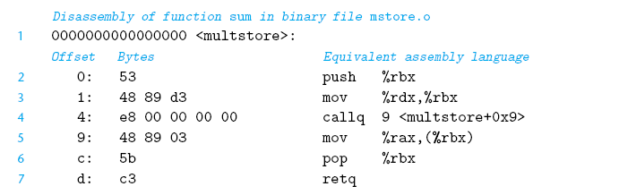
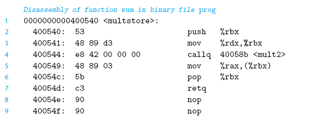
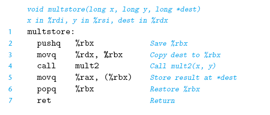

# 03: Machine-Level Representation of Programs

## 3.0 Introduction (Fundamental Concepts)

Computers execute **machine code**, _sequences of bytes encoding the low-level operations_ that manipulate data, manage memory, read and write data on storage devices, and communicate over networks. 

A **compiler** generates machine code through a series of stages, based on the rules of the programming language, the instruction set of the target machine, and the conventions followed by the operating system. 

The **gcc** C compiler generates its output in the form of **assembly code**, _a textual representation of the machine code_ giving the individual instructions in the program. gcc is the default compiler on Linux.

Gcc then invokes both an **assembler** and a **linker** _to generate the executable machine code from the assembly code_. In this chapter, we will take a close look at machine code and its human-readable representation as assembly code.

Even though compilers do most of the work in generating assembly code, being able to read and understand it is an important skill for serious programmers. By invoking the compiler with appropriate command-line parameters, the compiler will generate a file showing its output in assembly-code form. By reading this code, we can understand the optimization capabilities of the compiler and analyze the underlying inefficiencies in the code.

This is important to:

- programmers seeking to maximize the performance of a critical section of code
- when the layer of abstraction provided by a high-level language hides information about the run-time behavior of a program that we need to understand
- understand how program data are shared or kept private by the different threads and precisely how and where shared data are accessed
- understand how vulnerabilities arise and how to guard against them (this requires a knowledge of the machine-level representation of programs.)

>IA32, the 32-bit predecessor to x86-64, was introduced by Intel in 1985. It served as the machine language of choice for several decades. Most x86 microprocessors sold today, and most operating systems installed on these machines, are designed to run x86-64. However, they can also execute IA32 programs in a backward compatibility mode. As a result, many application programs are still based on IA32. In addition, many existing systems cannot execute x86-64, due to limitations of their hardware or system software. IA32 continues to be an important machine language. You will find that having a background in x86-64 will enable you to learn the IA32 machine language quite readily.
>
>The computer industry has recently made the transition from 32-bit to 64- bit machines. A 32-bit machine can only make use of around 4 gigabytes (232 bytes) of random access memory, With memory prices dropping at dramatic rates, and our computational demands and data sizes increasing, it has become both economically feasible and technically desirable to go beyond this limitation. Current 64-bit machines can use up to 256 terabytes (248 bytes) of memory, and could readily be extended to use up to 16 exabytes (264 bytes).

## 3.1 A Historical Perspective

List of the most important Intel processors and some of their key features, especially those affecting machine-level programming. We use the number of transistors required to implement the processors as an indication of how they have evolved in complexity. In this table, “K” denotes 1,000 (10<sup>3</sup>), “M” denotes 1,000,000 (10<sup>6</sup>), and “G” denotes 1,000,000,000 (10<sup>9</sup>).

- **8086** (1978, 29 K transistors): One of the first single-chip, 16-bit microprocessors. The 8088, a variant of the 8086 with an 8-bit external bus, formed the heart of the original IBM personal computers. In 1980, Intel introduced the 8087 floating-point coprocessor (45 K transistors) to operate alongside an 8086 or 8088 processor, executing the floating-point instructions.
- **80286** (1982, 134 K transistors): Added more (and now obsolete) addressing modes. Formed the basis of the IBM PC-AT personal computer, the original platform for MS Windows.
- **i386** (1985, 275 K transistors): Expanded the architecture to 32 bits. Added the flat addressing model used by Linux and recent versions of theWindows operating system. This was the first machine in the series that could fully support a Unix operating system.
- **i486** (1989, 1.2Mtransistors): Improved performance and integrated the floating-point unit onto the processor chip.
- **Pentium** (1993, 3.1M transistors): Improved performance.
- **PentiumPro** (1995, 5.5M transistors): Introduced a radically new processor design, internally known as the P6 microarchitecture. Added a class of “conditional move” instructions to the instruction set.
- **Pentium/MMX** (1997, 4.5Mtransistors): Added new class of instructions to the Pentium processor for manipulating vectors of integers. Each datum can be 1, 2, or 4 bytes long. Each vector totals 64 bits.
- **Pentium II** (1997, 7M transistors): Continuation of the P6 microarchitecture.
- **Pentium III** (1999, 8.2Mtransistors): Introduced SSE, a class of instructions for manipulating vectors of integer or floating-point data.
- **Pentium 4** (2000, 42M transistors): Extended SSE to SSE2, adding new data types (including double-precision floating point), along with 144 new instructions for these formats.With these extensions, compilers can use SSE instructions, rather than x87 instructions, to compile floating-point code.
- **Pentium 4E** (2004, 125Mtransistors): Added **hyperthreading**, a method to run two programs simultaneously on a single processor, as well as EM64T, Intel’s implementation of a 64-bit extension to IA32 developed by Advanced Micro Devices (AMD), which we refer to as x86-64.
- **Core 2** (2006, 291M transistors): Returned to a microarchitecture similar to P6. First multi-core Intel microprocessor, where multiple processors are implemented on a single chip. Did not support hyperthreading.
- **Core i7, Nehalem** (2008, 781Mtransistors): Incorporated both hyperthreading and multi-core, with the initial version supporting two executing programs on each core and up to four cores on each chip.
- **Core i7, Sandy Bridge** (2011, 1.17G transistors): Introduced AVX, an extension of the SSE to support data packed into 256-bit vectors.
- **Core i7, Haswell** (2013, 1.4G transistors): Extended AVX to AVX2, adding more instructions and instruction formats.

Each successive processor has been designed to be backward compatible —able to run code compiled for any earlier version.+

Over the years, several companies have produced processors that are compatible with Intel processors, capable of running the exact same machine-level programs. Chief among these is Advanced Micro Devices (AMD). For years, AMD lagged just behind Intel in technology, forcing a marketing strategy where they produced processors that were less expensive although somewhat lower in performance. They became more competitive around 2002.

Much of the complexity of x86 is not of concern to those interested in programs for the Linux operating system as generated by the gcc compiler. The memory model provided in the original 8086 and its extensions in the 80286 became obsolete with the i386. The original x87 floating-point instructions became obsolete with the introduction of SSE2.

## 3.2 Program Encodings

Suppose we write a C program as two files `p1.c` and `p2.c`. We can then compile this code using a Unix command line:

```sh
gcc -Og -o p p1.c p2.c
```

Analysis:

- `gcc` indicates the `gcc` C compiler.
- `-Og` instructs the compiler to apply a level of optimization that yields machine code that follows the overall structure of the original C code. Invoking higher levels of optimization can generate code that is so heavily transformed that the relationship between the generated machine code and the original source code is difficult to understand. `-Og` can be used as a learning tool; in practice, higher levels of optimization (e.g., specified with the option `-O1` or `-O2`) are considered a better choice in terms of the resulting program performance.
- `-o p` indicates the final executable code file generated, `p`.

The `gcc` command invokes an entire sequence of programs to turn the source code into executable code:



- First, the C **preprocessor** expands the source code to include any files specified with `#include` commands and to expand any macros, specified with #define declarations. 
- Second, the **compiler** generates **assembly code** versions of the two source files having names `p1.s` and `p2.s`. 
- Third, the **assembler** converts the assembly code into binary **object-code** files `p1.o` and `p2.o`. 
- Finally, the **linker** merges these two object-code files along with code implementing library functions (e.g., `printf`) and generates the final **executable code** file `p` (as specified by the command-line directive `-o p`). 

> There are two types of machine-code:
>
> - **Object code**: Object code is one form of machine code—it contains binary representations of all the instructions, but the addresses of global values are not yet filled in.
>
> - **Executable code**: Executable code is the second form of machine code we will consider —it is the exact form of code that is executed by the processor.
>

### 3.2.1 Machine-Level Code

Regarding machine-level programming, there are two important abstractions taking place:

- First, the format and behavior of a machine-level program is defined by the _instruction set architecture_, or **ISA**, defining the processor state, the format of the instructions, and the effect each of these instructions will have on the state. Most ISAs describe the behavior of a program sequentially (synchronously). The processor hardware is far more elaborate, executing many instructions concurrently, but it employs safeguards to ensure that the overall behavior matches the sequential operation dictated by the ISA. 
- Second, the memory addresses used by a machine-level program are **virtual addresses**, providing a memory model that appears to be a very large byte array. The actual implementation of the memory system involves a combination of multiple hardware memories and operating system software.

The compiler does most of the work in the overall compilation sequence, transforming programs expressed in the relatively abstract execution model provided by C into the very elementary instructions that the processor executes. The assembly-code representation is very close to machine code. Its main feature is that it is in a more readable textual format, as compared to the binary format of machine code.

The machine code for x86-64 differs greatly from the original C code. Parts of the processor state are visible that normally are hidden from the C programmer:

- The **program counter** (commonly referred to as the PC, and called `%rip` in x86- 64) indicates the address in memory of the next instruction to be executed. 
- The integer **register file** contains 16 named locations storing 64-bit values. These registers can hold addresses (corresponding to C pointers) or integer data. Some registers are used to keep track of critical parts of the program state, while others are used to hold temporary data, such as the arguments and local variables of a procedure, as well as the value to be returned by a function. 
- The **condition code registers** hold status information about the most recently executed arithmetic or logical instruction. These are used to implement conditional changes in the control or data flow, such as is required to implement `if` and `while` statements. 
- A set of **vector registers** can each hold one or more integer or floating-point values.

Machine code views the memory as simply a large byte-addressable array. Aggregate data types in C such as arrays and structures are represented in machine code as contiguous collections of bytes. Even for scalar data types, assembly code makes no distinctions.

The program memory contains:

- The executable machine code for the program, 
- some information required by the operating system, 
- a run-time **stack** for managing procedure calls and returns,
- blocks of memory allocated by the user (e.g., by using the `malloc` library function).

The program memory is addressed using virtual addresses. At any given time, only limited subranges of virtual addresses are considered valid.

In current x86-64 machines, the upper 16 bits in the addresses must be set to zero, and so an address can potentially specify a byte over a range of 2<sup>48</sup>, or 64 terabytes. More typical programs will only have access to a few megabytes, or perhaps several gigabytes. The operating system manages this virtual address space, translating virtual addresses into the physical addresses of values in the actual processor memory.

A single machine instruction performs only a very elementary operation. For example, it might add two numbers stored in registers, transfer data between memory and a register, or conditionally branch to a new instruction address. The compiler must generate sequences of such instructions to implement program constructs such as arithmetic expression evaluation, loops, or procedure calls and returns.

### 3.2.2 Code Examples

>We will show the code generated by a particular version of `gcc` with particular settings of the command-line options. If you compile code on your own machine, chances are you will be using a different compiler or a different version of `gcc` and hence will generate different code.
>
>The open source community supporting `gcc` keeps changing the code generator, attempting to generate more efficient code according to changing code guidelines provided by the microprocessor manufacturers. Our goal in studying the examples shown in our presentation is to demonstrate how to examine assembly code and map it back to the constructs found in high-level programming languages. 
>
>You will need to adapt these techniques to the style of code generated by your particular compiler.

Example file `mstore.c`, that contains a function definition:

```c
long mult2(long, long);

void multstore(long x, long y, long *dest) {
  long t = mult2(x, y);
  *dest = t;
}
```

To see the assembly code generated by the C compiler, we can use the `-S` option on the command line:

```sh
gcc -Og -S mstore.c
```

This will cause `gcc` to run the compiler, generating an assembly file `mstore.s`, and go no further. (Normally it would then invoke the assembler to generate an object-code file.)

The assembly-code file contains various declarations, including the following set of lines:

```assembly
multstore:
  pushq   %rbx
  movq    %rdx, %rbx
  call    mult2
  movq    %rax, (%rbx)
  popq    %rbx
  ret
```

Each indented line in the code corresponds to a single machine instruction. All information about local variable names or
data types has been stripped away.

If we use the `-c` command-line option, `gcc` will both compile and assemble the code

```sh
gcc -Og -c mstore.c
```

This will generate an object-code file `mstore.o` that is in binary format and hence cannot be viewed directly. Embedded within the 1,368 bytes of the file `mstore.o` is a 14-byte sequence with the hexadecimal representation 

```txt
53 48 89 d3 e8 00 00 00 00 48 89 03 5b c3
```

This is the object code corresponding to the assembly instructions listed previously. 

A key lesson to learn from this is that the program executed by the machine is simply a sequence of bytes encoding a series of instructions. The machine has very little information about the source code from which these instructions were generated.

To inspect the contents of machine-code files, a class of programs known as **disassemblers** can be invaluable. These programs generate a format similar to assembly code from the machine code. With Linux systems, the program `objdump` (for “object dump”) can serve this role given the `-d` command-line flag:

```sh
objdump -d mstore.o
```

The result (where we have added line numbers on the left and annotations in italicized text) is as follows:



On the left we see the 14 hexadecimal byte values, listed in the byte sequence shown earlier, partitioned into groups of 1 to 5 bytes each. Each of these groups is a single instruction, with the assembly-language equivalent shown on the right.

Several features about machine code and its disassembled representation are worth noting:

- x86-64 instructions can range in length from 1 to 15 bytes. The instruction encoding is designed so that commonly used instructions and those with fewer operands require a smaller number of bytes.
- From a given starting position, there is a unique decoding of the bytes into machine instructions.
- The disassembler determines the assembly code based purely on the byte sequences in the machine-code file.
- The disassembler uses a slightly different naming convention for the instructions than does the assembly code generated by `gcc`.

Generating the actual executable code requires running a linker on the set of object-code files, one of which must contain a function `main`.

Example file 2: `main.c`:

```c
#include <stdio.h>

void multstore(long, long, long *);

int main() {
  long d;
  multstore(2, 3, &d);
  printf("2 * 3 --> %ld\n", d);
  return 0;
}

long mult2(long a, long b) {
  long s = a * b;
  return s;
}
```

Then we could generate an executable program `prog` as follows:

```sh
gcc -Og -o prog main.c mstore.c
```

The file `prog` has grown to 8,655 bytes, since it contains not just the machine code for the procedures we provided but also code used to start and terminate the program as well as to interact with the operating system.

We can disassemble the file `prog`:

```sh
objdump -d prog
```



Although they are almost identical, there are important differences between this generated file and the one generated by disassemblying `mstore.c`:

- The linker has shifted the location of this code to a different range of addresses (on the leftmost column)
- The linker has filled in the address that the `callq` instruction should use in calling the function `mult2` (One task
for the linker is to match function calls with the locations of the executable code for those functions)
- we see two additional lines of code (lines 8–9). These instructions will have no effect on the program, since they occur after the return instruction (line 7). They have been inserted to grow the code for the function to 16 bytes, enabling a better placement of the next block of code in terms of memory system performance.

### 3.2.3 Notes on Formatting

The assembly code generated by `gcc` is difficult for a human to read:

- It contains information with which we need not be concerned
- it does not provide any description of the program or how it works.

If we generate a `mstore.s` file via

```sh
gcc -Og -S mstore.c
```

the full content of the file is:

```txt
        .file   "010-mstore.c"
        .text
        .globl  multstore
        .type   multstore, @function
multstore:
        pushq   %rbx
        movq    %rdx, %rbx
        call    mult2
        movq    %rax, (%rbx)
        popq    %rbx
        ret
        .size   multstore, .-multstore
        .ident  "GCC: (Ubuntu 4.8.1-2ubuntu1~12.04) 4.8.1"
        .section         .note.GNU-stack,"",@progbits
```

The lines beginning with `.` are directives to guide the assembler and linker. We can generally ignore these. On the other hand, there are no explanatory remarks about what the instructions do or how they relate to the source code.

An annotated version would appear as follows:



This is a stylized version of the way assembly-language programmers format their code.

>Interesting aside: there are ways to incorporate assembly code into C programs. For some applications, the programmer must drop down to assembly code to access low-level features of the machine. One approach is to write entire functions in assembly code and combine them with C functions during the linking stage; another is to use `gcc`’s support for embedding assembly code directly within C programs.

## 3.3 Data Formats


